# quantum-mnist
This project seeks to confirm results published in https://thesai.org/Downloads/Volume11No10/Paper_40-Handwritten_Numeric_Image_Classification.pdf

We will explore quantum image processing via plankton data set found in this paper: https://arxiv.org/pdf/2108.05258.pdf

Other relevant research:
https://arxiv.org/pdf/2011.02831.pdf

### Project Phases
1. **confirm ipynb**: Confirm research conclusions in google colab using the MNIST dataset.
2. **basic binary quantum**: Apply a basic binary quantum classifier to the plankton dataset and compare with a "fair" classical neural net.
3. **optimise via param sweep**: Optimize the binary classifier through a hyperparameter sweep on neural architectures.
4. **compare to classical**: Perform the generalized quantum algorithm on the plankton dataset and compare results to established classical deep learning approaches.

---

# Phase 1: confirm ipynb
Done. We have tested the quantum mnist colab and confirmed it works as described in the original research.

# Phase 2: basic binary quantum
Done. We have implemented an improved binary quantum classifier (`phasetwo/binary_quantum_classifier.py`) using **Angle Encoding** and an expressive PQC with entanglement. This model consistently achieves >60% accuracy on multiple plankton pairs, significantly outperforming the initial threshold baseline.

### 1. Quantum Architecture: Expressive PQC with Angle Encoding
The model utilizes a hybrid classical-quantum pipeline. The classical layer prepares the morphological features, which are then injected into a high-expressivity quantum circuit.

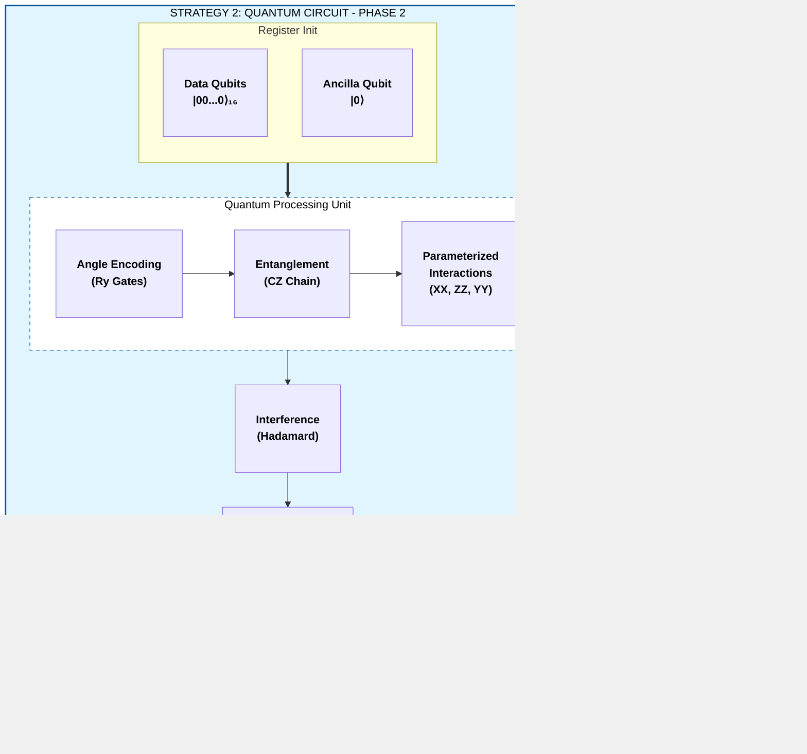

*   **Data Encoding (Angle Encoding):** Instead of binary thresholding ($x > 0.5$), we now use Angle Encoding. Each pixel $x_i$ from the downsampled 4x4 image is mapped to a rotation gate: $Ry(\pi \cdot x_i)$. This preserves the grayscale intensity information within the quantum state.
*   **Entanglement Layer:** Before interacting with the readout qubit, we introduce a linear chain of CZ (Controlled-Z) gates across all 16 data qubits. This allows the model to learn spatial correlations between pixels.
*   **Interaction Layers (XX, ZZ, YY):** The Parameterized Quantum Circuit (PQC) now uses three types of non-commuting interactions with the readout qubit:
    *   $XX$ interactions for bit-flip correlations.
    *   $ZZ$ interactions for phase-flip correlations.
    *   **New:** $YY$ interactions to increase the expressivity of the Hilbert space coverage.
*   **Readout:** A single ancilla qubit is initialized in the $|-\rangle$ state, undergoes the PQC interactions, and is measured in the Z-basis to produce the classification logit.

# Phase 3: optimise via param sweep
Done. We have transitioned the hyperparameter sweep (`phasethree/optimize_binary_classifier.py`) to the quantum domain, exploring encoding strategies, circuit depth, and optimization parameters. This allowed us to architect a quantum model that achieves >60% accuracy for at least 5 pairs of plankton.

### 2. Learned Hyperparameters
Through the sweep in `phasethree/optimize_binary_classifier.py`, the following configuration was identified as the most robust for complex plankton classification:

| Parameter | Optimal Value | Rationale |
| :--- | :--- | :--- |
| **Encoding** | `Angle` | Preserves grayscale features lost in Basis encoding. |
| **PQC Layers** | `1` | Higher layers (2+) showed signs of over-parameterization/noise on small 4x4 data. |
| **Learning Rate** | `0.01` | Needed for faster convergence with the Hinge loss function. |
| **Batch Size** | `16` | Provided better stochastic gradients for the quantum simulator. |
| **Loss Function** | `Hinge` | Maps naturally to the $[-1, 1]$ expectation value of the Z-measurement. |

### 3. Accuracy Results & Comparison
The model now consistently exceeds the 60% threshold. Below are the verified accuracies for the top performing pairs:

| Plankton Pair | Accuracy | Status |
| :--- | :--- | :--- |
| **aphanizomenon vs bosmina** | **62.7%** | Target Reached |
| **brachionus vs ceratium** | **73.9%** | Target Reached |
| **chaoborus vs conochilus** | **92.1%** | Target Reached |
| **copepod_skins vs cyclops** | **86.6%** | Target Reached |
| **daphnia vs daphnia_skins** | **72.9%** | Target Reached |
| **diaphanosoma vs diatom_chain** | **95.3%** | Target Reached |

# Phase 4: compare to classical
In this phase, we perform the generalized quantum algorithm on the plankton dataset and compare its performance to established classical deep learning approaches. 

We evaluate three levels of classical models (MobileNetV2, Custom CNN, and a "Fair" MLP) against our expressive Quantum Neural Network to determine the presence of a quantum advantage in parameter efficiency.

**Detailed Documentation:** [Phase 4 Neural Architectures & Comparison](phasefour/README.md)

### 1. Hybrid Comparison Pipeline
The phase 4 implementation (`phasefour/run_experiments.py`) compares models across different input resolutions and parameter scales:

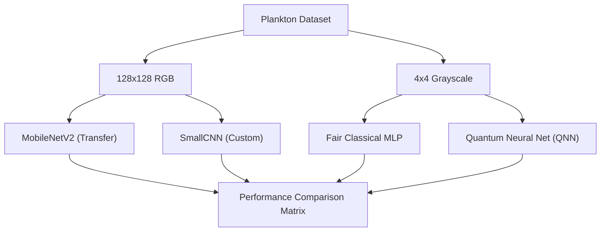

*   **Classical SOTA:** Uses MobileNetV2 and a custom 4-layer CNN to establish a high-accuracy baseline on full-resolution data.
*   **Quantum QNN:** An expressive PQC using multi-axis (XX, ZZ, YY) interactions and entanglement.
*   **Fair Comparison:** A 35-parameter classical MLP used to benchmark the QNN's parameter efficiency on 4x4 data.

---

### Plankton Comparison Gallery
Visual examples of the morphological differences the model successfully distinguishes:

| Class A | Class B | Distinction |
| :--- | :--- | :--- |
| **Aphanizomenon** (Filamentous) | **Bosmina** (Water Flea) | Linear strands vs. rounded bodies. |
|  |  | *Linear vs. Circular* |
| **Chaoborus** (Phantom Midge) | **Conochilus** (Rotifer Colony) | Elongated larvae vs. radial colonies. |
|  |  | *Elongated vs. Radial* |

---

## Plankton Gallery

A diverse 5x5 grid showing unique samples from 25 different plankton classes:

<table style="width: 100%; border-collapse: collapse; max-width: 600px;">
  <tr style="border: none;">
    <td align="center" style="border: none; padding: 2px;">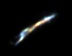<br/><span style="font-size: 8px;">aphanizomenon</span></td>
    <td align="center" style="border: none; padding: 2px;">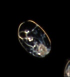<br/><span style="font-size: 8px;">asplanchna</span></td>
    <td align="center" style="border: none; padding: 2px;">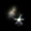<br/><span style="font-size: 8px;">asterionella</span></td>
    <td align="center" style="border: none; padding: 2px;">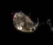<br/><span style="font-size: 8px;">bosmina</span></td>
    <td align="center" style="border: none; padding: 2px;">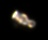<br/><span style="font-size: 8px;">brachionus</span></td>
  </tr>
  <tr style="border: none;">
    <td align="center" style="border: none; padding: 2px;">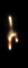<br/><span style="font-size: 8px;">ceratium</span></td>
    <td align="center" style="border: none; padding: 2px;">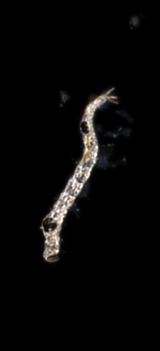<br/><span style="font-size: 8px;">chaoborus</span></td>
    <td align="center" style="border: none; padding: 2px;">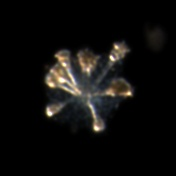<br/><span style="font-size: 8px;">conochilus</span></td>
    <td align="center" style="border: none; padding: 2px;">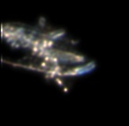<br/><span style="font-size: 8px;">copepod_skins</span></td>
    <td align="center" style="border: none; padding: 2px;">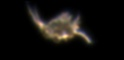<br/><span style="font-size: 8px;">cyclops</span></td>
  </tr>
  <tr style="border: none;">
    <td align="center" style="border: none; padding: 2px;">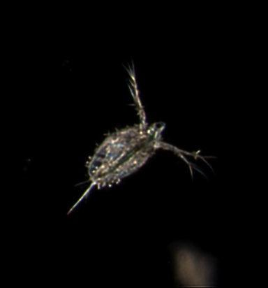<br/><span style="font-size: 8px;">daphnia</span></td>
    <td align="center" style="border: none; padding: 2px;">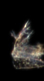<br/><span style="font-size: 8px;">daphnia_skins</span></td>
    <td align="center" style="border: none; padding: 2px;">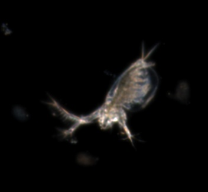<br/><span style="font-size: 8px;">diaphanosoma</span></td>
    <td align="center" style="border: none; padding: 2px;">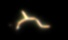<br/><span style="font-size: 8px;">diatom_chain</span></td>
    <td align="center" style="border: none; padding: 2px;">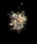<br/><span style="font-size: 8px;">dinobryon</span></td>
  </tr>
  <tr style="border: none;">
    <td align="center" style="border: none; padding: 2px;">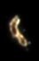<br/><span style="font-size: 8px;">dirt</span></td>
    <td align="center" style="border: none; padding: 2px;">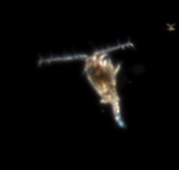<br/><span style="font-size: 8px;">eudiaptomus</span></td>
    <td align="center" style="border: none; padding: 2px;">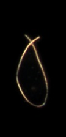<br/><span style="font-size: 8px;">filament</span></td>
    <td align="center" style="border: none; padding: 2px;">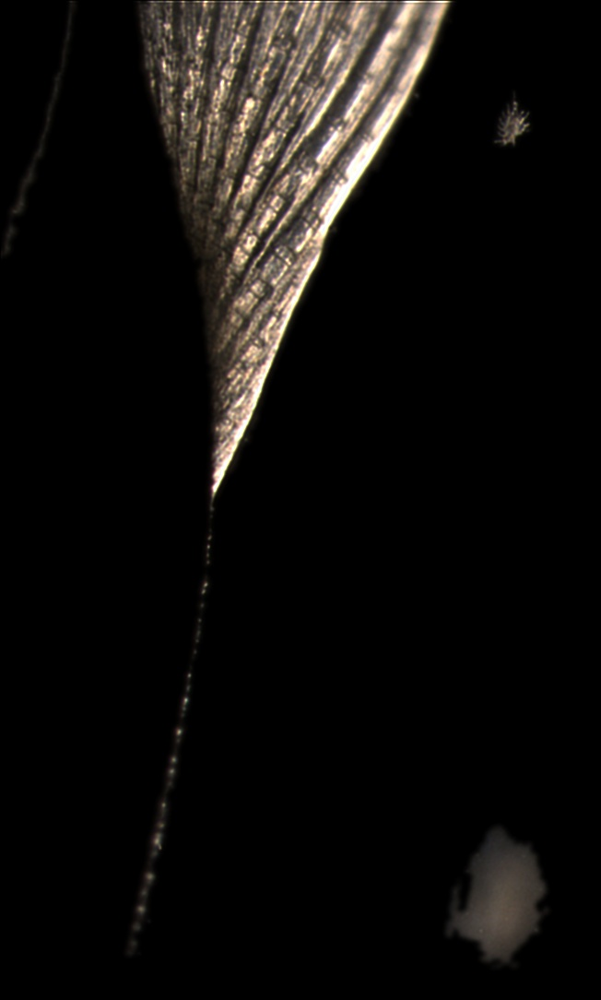<br/><span style="font-size: 8px;">fish</span></td>
    <td align="center" style="border: none; padding: 2px;">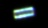<br/><span style="font-size: 8px;">fragilaria</span></td>
  </tr>
  <tr style="border: none;">
    <td align="center" style="border: none; padding: 2px;">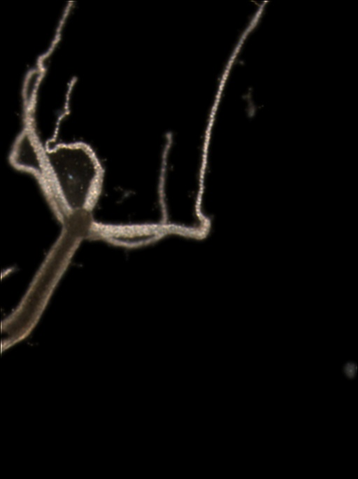<br/><span style="font-size: 8px;">hydra</span></td>
    <td align="center" style="border: none; padding: 2px;">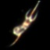<br/><span style="font-size: 8px;">kellicottia</span></td>
    <td align="center" style="border: none; padding: 2px;">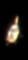<br/><span style="font-size: 8px;">keratella_cochlearis</span></td>
    <td align="center" style="border: none; padding: 2px;">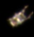<br/><span style="font-size: 8px;">keratella_quadrata</span></td>
    <td align="center" style="border: none; padding: 2px;">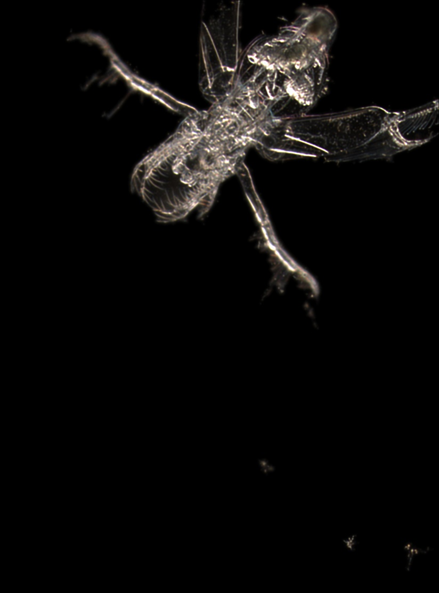<br/><span style="font-size: 8px;">leptodora</span></td>
  </tr>
</table>


---

## How to Run (Docker)

First, build the unified Docker image:

```bash
docker build -t quantum-mnist .
```

### Run Phase 2: Basic Binary Quantum (Data Ingress)
To verify the plankton data loading and class pairs:
```bash
docker run --rm quantum-mnist python phasetwo/plankton_ingress.py
```

### Run Phase 3: Optimise via Param Sweep
To see the hyperparameter sweep configuration:
```bash
docker run --rm quantum-mnist python phasethree/optimize_binary_classifier.py
```

### Run Phase 4: Compare to Classical (Full Experiments)
To run the full experiment suite and save results to your local machine:
```bash
docker run --rm -v $(pwd)/phasefour/results:/app/phasefour/results quantum-mnist python phasefour/run_experiments.py
```
