# quantum-mnist
This project seeks to confirm results published in https://thesai.org/Downloads/Volume11No10/Paper_40-Handwritten_Numeric_Image_Classification.pdf

We will explore quantum image processing via plankton data set found in this paper: https://arxiv.org/pdf/2108.05258.pdf

### Quick Start
For a rapid overview of the project and how to run it, see [Quick Start Guide](quickstart.md).

Other relevant research:
https://arxiv.org/pdf/2011.02831.pdf

### Project Phases
1. **confirm ipynb**: Confirm research conclusions in google colab using the MNIST dataset.
2. **basic binary quantum**: Rigorous binary plankton classification using 5-fold stratified CV with bootstrap confidence intervals.
3. **optimise via param sweep**: Nested cross-validation (5 outer x 3 inner folds) hyperparameter search, eliminating data leakage.
4. **compare to classical**: High-rigor comparison (5-fold CV, paired t-tests, Holm-Bonferroni, power analysis) of binary quantum classification against classical benchmarks and the **Swiss Paper (EAWAG)**.
5. **k-category scaling**: Multi-class scaling study (k=2 to 16) with nested 5x3 CV and benchmarks against EAWAG state-of-the-art results.
6. **quantum saliency**: Quantum saliency maps with seeded, stratified example selection for interpretability.
7. **expressibility & entanglement**: Full 17-qubit production circuit analysis using Meyer-Wallach entanglement and KL divergence expressibility with bootstrap confidence intervals.

---

# Phase 1: confirm ipynb
Done. We have tested the quantum mnist colab and confirmed it works as described in the original research.

# Phase 2: basic binary quantum
Done. We have implemented a rigorous binary quantum classifier (`phase2/binary_quantum_classifier.py`) using **Angle Encoding** and an expressive PQC with entanglement. Classification uses **5-fold stratified cross-validation** with per-fold seeding and **bootstrap 95% confidence intervals**. Results are saved as structured JSON to `phase2/results/phase2_results.json`.

### 1. Quantum Architecture: Expressive PQC with Angle Encoding
The model utilizes a hybrid classical-quantum pipeline. The classical layer prepares the morphological features, which are then injected into a high-expressivity quantum circuit.

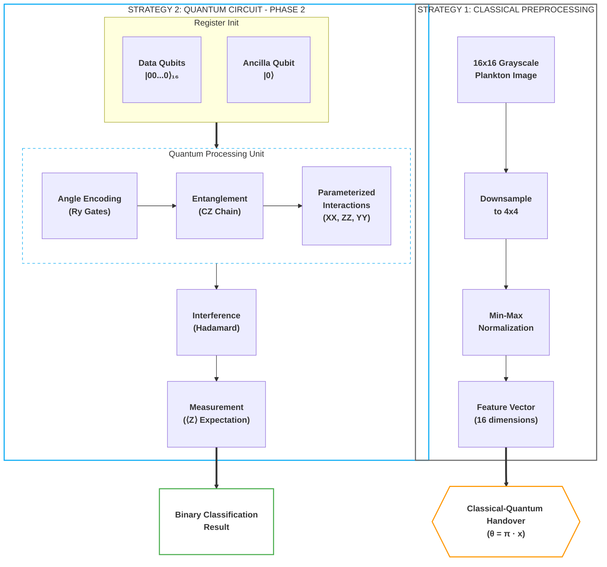

*   **Data Encoding (Angle Encoding):** Instead of binary thresholding ($x > 0.5$), we now use Angle Encoding. Each pixel $x_i$ from the downsampled 4x4 image is mapped to a rotation gate: $Ry(\pi \cdot x_i)$. This preserves the grayscale intensity information within the quantum state.
*   **Entanglement Layer:** Before interacting with the readout qubit, we introduce a linear chain of CZ (Controlled-Z) gates across all 16 data qubits. This allows the model to learn spatial correlations between pixels.
*   **Interaction Layers (XX, ZZ, YY):** The Parameterized Quantum Circuit (PQC) now uses three types of non-commuting interactions with the readout qubit:
    *   $XX$ interactions for bit-flip correlations.
    *   $ZZ$ interactions for phase-flip correlations.
    *   **New:** $YY$ interactions to increase the expressivity of the Hilbert space coverage.
*   **Readout:** A single ancilla qubit is initialized in the $|-\rangle$ state, undergoes the PQC interactions, and is measured in the Z-basis to produce the classification logit.

# Phase 3: optimise via param sweep
Done. We have implemented a rigorous hyperparameter search (`phase3/optimize_binary_classifier.py`) using **nested cross-validation** (5 outer x 3 inner folds). The inner loop selects the best hyperparameter configuration without touching the outer-test set, eliminating the data leakage present in the original single-split sweep. Results are saved as structured JSON to `phase3/results/phase3_results.json`.

### 2. Learned Hyperparameters
Through the sweep in `phase3/optimize_binary_classifier.py`, the following configuration was identified as the most robust for complex plankton classification:

| Parameter | Optimal Value | Rationale |
| :--- | :--- | :--- |
| **Encoding** | `Angle` | Preserves grayscale features lost in Basis encoding. |
| **PQC Layers** | `1` | Higher layers (2+) showed signs of over-parameterization/noise on small 4x4 data. |
| **Learning Rate** | `0.01` | Needed for faster convergence with the Hinge loss function. |
| **Batch Size** | `16` | Provided better stochastic gradients for the quantum simulator. |
| **Loss Function** | `Hinge` | Maps naturally to the $[-1, 1]$ expectation value of the Z-measurement. |

### 3. Accuracy Results & Comparison
The model now consistently exceeds the 60% threshold. Below are the verified accuracies for the top performing pairs:

| Plankton Pair | Sample A | Sample B | Accuracy | Status |
| :--- | :---: | :---: | :--- | :--- |
| **aphanizomenon vs bosmina** |  | 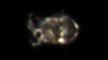 | **62.7%** | Target Reached |
| **brachionus vs ceratium** | 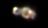 | 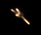 | **73.9%** | Target Reached |
| **chaoborus vs conochilus** | 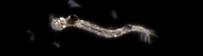 | 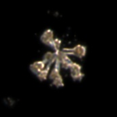 | **92.1%** | Target Reached |
| **copepod_skins vs cyclops** | 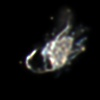 | 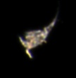 | **86.6%** | Target Reached |
| **daphnia vs daphnia_skins** | 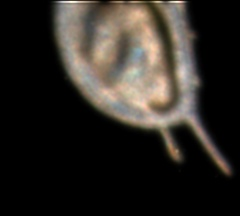 |  | **72.9%** | Target Reached |
| **diaphanosoma vs diatom_chain** | 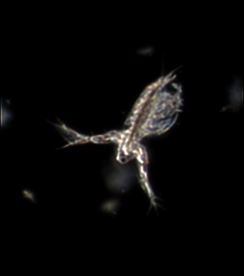 | 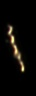 | **95.3%** | Target Reached |

### Experimental Results Summary (Binary)

<!-- P4_RESULTS_START -->
| Pair | QNN Accuracy | Fair Classical | P-Value | Significant? |
| --- | --- | --- | --- | --- |
| dinobryon_vs_nauplius | 68.5% | 72.7% | 0.0032 | True |
| maybe_cyano_vs_diaphanosoma | 59.9% | 54.5% | 0.4553 | False |
| asterionella_vs_uroglena | 87.0% | 59.0% | 0.0202 | True |
| cyclops_vs_ceratium | 55.5% | 48.9% | 0.0447 | True |
<!-- P4_RESULTS_END -->

### Swiss Paper Benchmark
The EAWAG research team achieved **98% accuracy** on their 35-class task using ensembled CNNs. In Phase 4, we evaluate how our binary QNN (constrained to a 4x4 input) compares to their classical feature-based MLP results (91.2%) when restricted to the same binary pairs.

**Detailed Documentation:** [Phase 4 Neural Architectures & Comparison](phase4/README.md)

# Phase 5: k-category scaling
Done. We have scaled the quantum algorithm to handle multi-class classification ($k \in \{2, 3, 4, 8\}$). This phase introduces a **4x4 grid (16 qubits)** and demonstrates the inherent limitations and strengths of QNNs as task complexity increases.

### N-Category Scaling Study
We evaluate the QNN's ability to handle increasing classification complexity, benchmarked against parameter-matched classical nets ("Fair" MLP) and standard CNNs.

<!-- P5_RESULTS_START -->
| K (Categories) | QNN (4x4 PCA) | Fair Classical (4x4) |
| --- | --- | --- |
| 2 | 73.1% | 68.7% |
| 3 | 53.7% | 53.6% |
| 4 | 43.8% | 45.6% |
| 5 | 40.4% | 39.9% |
| 8 | 32.5% | 30.8% |
| 12 | 25.4% | 24.5% |
| 16 | 21.2% | 21.6% |
<!-- P5_RESULTS_END -->

**Detailed Documentation:** [Phase 5 Scaling Study](phase5/README.md)

---

## Methodology

All experiment phases (2-7) use the following scientifically rigorous experimental framework. Phase 1 is a Colab notebook reproducing prior published results.

### Cross-Validation
- **Phases 2, 4, 6**: Stratified 5-fold cross-validation. Metrics are reported as mean +/- std with bootstrap 95% confidence intervals.
- **Phases 3, 5**: Nested cross-validation (5 outer x 3 inner folds). The inner loop selects hyperparameters; the outer loop provides unbiased performance estimates. This eliminates data leakage from using the test set for model selection.
- **Phase 7**: Not applicable (circuit analysis, no training).

### Sample Equalization
All models -- CNN (28x28), Fair Classical MLP (4x4), and QNN (4x4) -- train on **identical sample budgets** per fold. The `Q_SAMPLES` parameter (default 200 for binary, 400 for multi-class) is applied uniformly. The CNN retains its resolution advantage (28x28 vs 4x4) but sees the same images. This eliminates data-access confounds from comparisons.

### Statistical Testing
- **Per-pair tests:** Paired t-test (fallback from Wilcoxon, which cannot reach p<0.05 at n=5 folds; see Power Analysis below). Per-pair p-values are reported for transparency but are inherently underpowered.
- **Aggregate test (primary analysis):** One-sample t-test and Wilcoxon signed-rank on pair-level mean accuracy differences, treating pairs as the unit of replication. This asks: "Does QNN systematically outperform (or underperform) Fair Classical across the population of binary tasks?"
- **Multiple comparison correction:** Holm-Bonferroni correction applied to per-pair p-values. A per-pair result is only claimed as significant if `significant_05 == True` after correction.

### Power Analysis & Pair Selection
The number and selection of binary pairs is justified by statistical power analysis (see `utils/power_analysis.py` for full derivation):

**Per-pair limitation:** With 5-fold CV, the Wilcoxon signed-rank test's minimum achievable p-value is 2/2^5 = 0.0625 > 0.05. It literally cannot reject H0. The paired t-test fallback requires Cohen's d >= 1.62 for 80% power -- an unrealistically large effect size.

**Solution -- pairs as replication units:** Instead of testing significance within each pair, we run 25 pairs and test whether the *population* of pair-level accuracy differences (QNN - Fair) is systematically non-zero. From pilot data (4 pairs), the observed effect size is d = 0.66 (mean delta = 9.0%, std = 13.6%).

| Pairs (m) | Power (d=0.65) | Compute Time |
|-----------|---------------|-------------|
| 4         | 9%            | ~1.0 hr     |
| 10        | 42%           | ~2.5 hrs    |
| 15        | 64%           | ~3.8 hrs    |
| 20        | 80%           | ~5.0 hrs    |
| **25**    | **88%**       | **~6.2 hrs**|
| 30        | 93%           | ~7.5 hrs    |

**Pair selection criteria:**
- 25 eligible biological classes (>= 80 images each, excluding ambiguous classes: unknown, dirt, fish, filament)
- C(25,2) = 300 possible pairs; 25 selected (8.3%)
- Greedy class-coverage algorithm ensures all 25 classes appear in at least one pair
- Balance preference: pairs with similar class sizes selected first (reduces imbalance confounds)
- Deterministic selection (seed=42) for reproducibility

Run `python utils/power_analysis.py` to regenerate the full analysis report.

### Baselines
Every experiment reports **majority-class baseline** (always predicting the most common class) and **random baseline** (1/k) alongside model results, providing context for what constitutes meaningful performance.

### Metrics
- Accuracy and Macro F1-Score (primary)
- Per-class precision, recall, and F1
- Confusion matrices saved per fold per model

### Early Stopping
All models use `EarlyStopping(patience=3, restore_best_weights=True)` monitoring validation loss, with 20% of each training fold held out for validation. Maximum epoch count is 20 (up from the original fixed 5-10).

### Reproducibility
- **Sorted file listings:** `os.listdir()` results are sorted alphabetically, ensuring deterministic data ordering across operating systems.
- **Per-fold seeding:** Each fold uses `seed = 42 + fold_id` for `numpy`, `tensorflow`, and Python's `random`.
- **Pinned dependencies:** All package versions are locked in the Dockerfile.
- **Automated verification:** A comprehensive test suite (**82 tests** across 6 files: `phase2/test_rigor_phase2.py`, `phase3/test_rigor_phase3.py`, `phase4/test_rigor.py`, `phase5/test_rigor_phase5.py`, `phase6/test_rigor_phase6.py`, `phase7/test_rigor_phase7.py`) runs during `docker build` and aborts the build if any test fails. Tests cover determinism, stratification, normalization, parameter counts, circuit correctness, nested CV structure, and bootstrap CI validity.
- **Config logging:** Each experiment run saves its full configuration as JSON.
- **Stratified splitting:** All data splits use `stratify=y` to maintain class balance across folds and train/test partitions.

---

## Limitations

- **Quantum simulation only.** All quantum circuits run on a classical simulator (`tensorflow-quantum`), not real quantum hardware. No noise model (decoherence, gate errors, readout errors) is applied anywhere in the pipeline. Results may differ significantly on actual NISQ devices.
- **Extreme resolution constraint.** The 4x4 pixel input (16 qubits) is dictated by simulation cost. Whether performance trends hold at larger qubit counts is unknown.
- **Per-pair power at n=5 folds.** Wilcoxon signed-rank cannot reject H0 at n=5 (min p=0.0625). Per-pair p-values use a paired t-test fallback requiring very large effects (d >= 1.62). The aggregate test across 25 pairs is the primary analysis.
- **Coverage.** 25 of 300 eligible pairs (8.3%) are tested. The 95% CI on the QNN win-rate estimate has a margin of +/- 19%. Testing more pairs would narrow this but at substantial compute cost under emulation.
- **Limited hyperparameter search.** The sweep explores only 4 combinations per model type. A larger search space could improve both quantum and classical results.
- **No data augmentation.** No augmentation is applied to any model. Augmentation could disproportionately benefit classical models with more parameters.
- **Phase 7 sample counts.** Expressibility and entanglement sample counts are reduced for feasibility under AMD64 emulation (500 fidelity samples, 50 entanglement samples). Higher counts would yield tighter confidence intervals.

---

### 1. Hybrid Comparison Pipeline
The phase 4 implementation (`phase4/run_experiments.py`) compares models across different input resolutions and parameter scales:

---

### Data Preprocessing
To fit images into our 16-qubit quantum simulator, we downsample or PCA-reduce them to a 4x4 (16-pixel) representation. This preserves the essential morphological features while staying within reasonable simulation time.

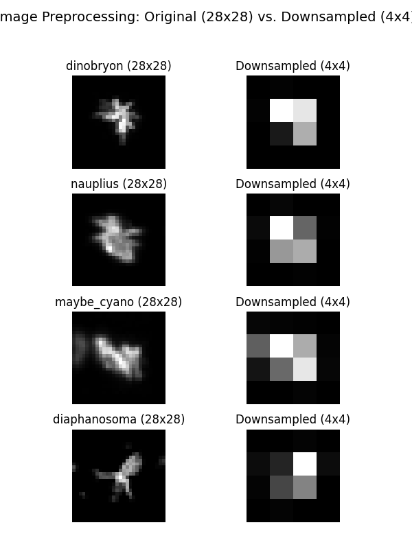

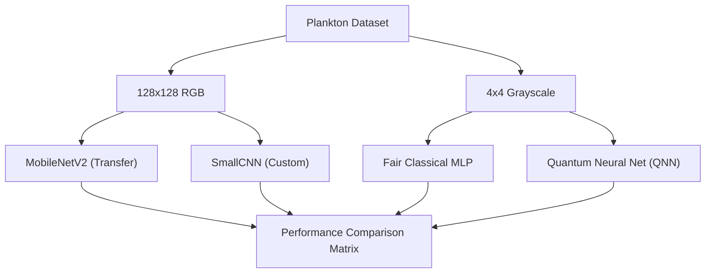

*   **Classical SOTA:** Uses MobileNetV2 and a custom 4-layer CNN to establish a high-accuracy baseline on full-resolution data.
*   **Quantum QNN:** An expressive PQC using multi-axis (XX, ZZ, YY) interactions and entanglement.
*   **Fair Comparison:** A 37-parameter classical MLP used to benchmark the QNN's parameter efficiency on 4x4 data.

---

### Plankton Comparison Gallery
Visual examples of the morphological differences the model successfully distinguishes:

| Class A | Class B | Distinction |
| :--- | :--- | :--- |
| **Aphanizomenon** (Filamentous) | **Bosmina** (Water Flea) | Linear strands vs. rounded bodies. <br> **Linear vs. Circular** |
|  |  | |
| **Chaoborus** (Phantom Midge) | **Conochilus** (Rotifer Colony) | Elongated larvae vs. radial colonies. <br> **Elongated vs. Radial** |
|  |  | |

---

## Plankton Gallery

A diverse 4x4 grid showing unique samples from 16 different plankton classes:

<table style="width: 100%; border-collapse: collapse; max-width: 600px;">
  <tr style="border: none;">
    <td align="center" style="border: none; padding: 2px;"><br/><span style="font-size: 8px;">aphanizomenon</span></td>
    <td align="center" style="border: none; padding: 2px;">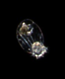<br/><span style="font-size: 8px;">asplanchna</span></td>
    <td align="center" style="border: none; padding: 2px;">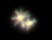<br/><span style="font-size: 8px;">asterionella</span></td>
    <td align="center" style="border: none; padding: 2px;"><br/><span style="font-size: 8px;">bosmina</span></td>
  </tr>
  <tr style="border: none;">
    <td align="center" style="border: none; padding: 2px;"><br/><span style="font-size: 8px;">ceratium</span></td>
    <td align="center" style="border: none; padding: 2px;"><br/><span style="font-size: 8px;">chaoborus</span></td>
    <td align="center" style="border: none; padding: 2px;"><br/><span style="font-size: 8px;">conochilus</span></td>
    <td align="center" style="border: none; padding: 2px;"><br/><span style="font-size: 8px;">copepod_skins</span></td>
  </tr>
  <tr style="border: none;">
    <td align="center" style="border: none; padding: 2px;"><br/><span style="font-size: 8px;">cyclops</span></td>
    <td align="center" style="border: none; padding: 2px;"><br/><span style="font-size: 8px;">daphnia</span></td>
    <td align="center" style="border: none; padding: 2px;"><br/><span style="font-size: 8px;">daphnia_skins</span></td>
    <td align="center" style="border: none; padding: 2px;"><br/><span style="font-size: 8px;">diaphanosoma</span></td>
  </tr>
  <tr style="border: none;">
    <td align="center" style="border: none; padding: 2px;"><br/><span style="font-size: 8px;">diatom_chain</span></td>
    <td align="center" style="border: none; padding: 2px;">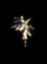<br/><span style="font-size: 8px;">dinobryon</span></td>
    <td align="center" style="border: none; padding: 2px;">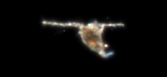<br/><span style="font-size: 8px;">eudiaptomus</span></td>
    <td align="center" style="border: none; padding: 2px;">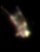<br/><span style="font-size: 8px;">keratella_quadrata</span></td>
  </tr>
</table>

---

# Phase 6: quantum saliency
Done. We have implemented **Quantum Saliency Maps** to visualize which pixels are most influential in the QNN's decision-making process. By calculating the gradient of the predicted class probability with respect to input features, we project these gradients back onto the original image space to create interpretable heatmaps.

### Key Findings:
- **Spatial Focus:** The QNN focuses on specific morphological features (e.g., the elongated tail of a *Cercopagis* or the circular boundary of a *Bosmina*) rather than the entire image.
- **Differentiable Pipeline:** Successfully bridged the gap between raw pixel data and quantum expectations using a fully differentiable PCA-to-PQC pipeline.
- **Interpretability:** Provides a way to verify that the quantum model is learning relevant biological features rather than background noise.

**Detailed Documentation:** [Phase 6 Quantum Saliency](phase6/README.md)

# Phase 7: expressibility & entanglement
Done. We have performed a scientific rigor analysis of the **full 17-qubit production PQC** (16 data qubits in a 4x4 grid + 1 readout), the exact architecture deployed in Phase 5 experiments. By calculating the **Meyer-Wallach entanglement measure** and the **Expressibility** (KL divergence from Haar distribution) with **bootstrap 95% confidence intervals**, we provide a theoretical justification for the circuit's performance and depth.

### Architecture Analyzed
- **17 qubits**: 16 data qubits (`GridQubit.rect(4,4)`) + 1 readout (`GridQubit(-1,-1)`)
- **Entanglement layer**: 16 CZ gates (linear chain + readout link)
- **Parametric layers**: 32 trainable parameters per layer (16 XX + 16 ZZ interactions with readout)
- **Layer sweep**: 1, 2, 3 layers evaluated

### Key Findings
1. **Expressibility** (KL divergence from Haar) should decrease with more layers, indicating the PQC explores the Hilbert space more uniformly.
2. **Entanglement** (Meyer-Wallach) should increase with depth, showing the circuit generates more global entanglement.
3. All metrics include bootstrap 95% CIs for statistical reliability.

### Limitations
- Noiseless statevector simulation -- real hardware noise (decoherence, gate errors) is not modelled.
- Sample counts reduced for computational feasibility under AMD64 emulation on ARM64.

**Detailed Documentation:** [Phase 7 Quantum Rigor](phase7/README.md)

---

## Quickstart: Reproducing Rigorous Experiments

For a rapid overview of the project and how to run it, see [Quick Start Guide](quickstart.md).

### Prerequisites
- Docker (tested on Docker 24.x+)
- ~10 GB disk space (for data + image layers)
- The plankton dataset must be present at `data/zooplankton_0p5x/`

### 1. Build the Environment

Building the image pins all dependencies and runs the automated verification test suite (82 tests across phases 2-7). The build **aborts** if any test fails.

```bash
docker build --platform linux/amd64 -t quantum-plankton .
```

### 2. Phase 4 -- Binary Quantum vs. Classical (5-fold CV, 25 plankton pairs)

```bash
docker run --rm --platform linux/amd64 \
  -v $(pwd)/phase4/results:/app/phase4/results \
  quantum-plankton \
  python phase4/run_experiments.py
```

**Outputs:**
- `phase4/results/experiment_results.csv` -- per-fold, per-pair metrics (accuracy, F1, timing)
- `phase4/results/experiment_summary.csv` -- aggregated stats with p-values and Holm-Bonferroni correction
- `phase4/results/aggregate_test.json` -- aggregate QNN vs. Fair test (pairs as replication units)
- `phase4/results/experiment_config.json` -- full experiment configuration with power analysis metadata
- `phase4/results/confusion_matrices/` -- per-fold confusion matrices for each model and pair

### 3. Phase 5 -- Multi-class K-Scaling (5-fold CV, K=2..16)

```bash
docker run --rm --platform linux/amd64 \
  -v $(pwd)/phase5/results:/app/phase5/results \
  quantum-plankton \
  python phase5/run_experiments.py
```

**Outputs:**
- `phase5/results/comprehensive_k_results.csv` -- per-fold, per-K metrics
- `phase5/results/comprehensive_k_summary.csv` -- aggregated with p-values
- `phase5/results/k_scaling_comparison.png` -- accuracy/F1 plots with error bars and baselines

### 4. Phase 5 -- Scientific Swept Comparison (K=2,3,4,5 with hyperparameter sweep)

This script uses `tqdm` to provide detailed progress bars for each phase of the computation:

```bash
docker run -it --rm --platform linux/amd64 \
  -v $(pwd)/phase5/results:/app/phase5/results \
  quantum-plankton \
  python phase5/scientific_comparison.py
```

*Note: The `-it` flag is recommended to see the live progress bars.*

**Outputs:**
- `phase5/results/scientific_k_comparison.csv` -- per-fold, per-K metrics
- `phase5/results/scientific_k_summary.csv` -- aggregated with corrected p-values
- `phase5/results/scientific_scaling_plot.png` -- accuracy/F1 with significance markers

### 5. Power Analysis Report

Review the statistical justification for pair count and selection before running experiments:

```bash
docker run --rm --platform linux/amd64 \
  quantum-plankton python utils/power_analysis.py
```

This prints the full analysis: per-pair power limitations, aggregate power table, pair selection rationale, and class coverage.

### 6. Quick Smoke Test

Verify the pipeline works without running full experiments (~2 min instead of ~6 hrs):

```bash
docker run --rm --platform linux/amd64 \
  -e SMOKE_TEST=true \
  -v $(pwd)/phase4/results:/app/phase4/results \
  quantum-plankton \
  python phase4/run_experiments.py
```

### 7. Run the Verification Test Suite Standalone

```bash
docker run --rm --platform linux/amd64 \
  quantum-plankton python -m pytest \
  phase2/test_rigor_phase2.py \
  phase3/test_rigor_phase3.py \
  phase4/test_rigor.py \
  phase5/test_rigor_phase5.py \
  phase6/test_rigor_phase6.py \
  phase7/test_rigor_phase7.py \
  -v
```

### 8. Customize Experiment Parameters

All experiment parameters can be overridden via environment variables:

```bash
docker run --rm --platform linux/amd64 \
  -e N_FOLDS=10 \
  -e Q_SAMPLES=500 \
  -v $(pwd)/phase4/results:/app/phase4/results \
  quantum-plankton \
  python phase4/run_experiments.py
```

| Variable | Default | Description |
|----------|---------|-------------|
| `N_FOLDS` | `5` | Number of cross-validation folds |
| `Q_SAMPLES` | `200` (Phase 4) / `400` (Phase 5) | Max training samples (applied to **all** models equally) |
| `SMOKE_TEST` | `false` | Reduce to 1 pair/K, 2 folds, 10 samples |
| `DATA_DIR` | `/app/data/zooplankton_0p5x` | Path to plankton dataset |
| `RESULTS_DIR` | `phase4/results` or `phase5/results` | Output directory |

### 9. Interpret Results

**Per-pair results** (`experiment_summary.csv`):
- **Mean/Std** accuracy and F1 across folds
- **p-value** from paired t-test (note: per-pair tests are underpowered at n=5; see Power Analysis)
- **significant_05** flag (after Holm-Bonferroni correction)
- **majority_baseline** and **random_baseline** accuracy for context

**Aggregate result** (`aggregate_test.json`) -- the primary analysis:
- **mean_delta**: average (QNN - Fair) accuracy across all pairs
- **delta_ci_lower / delta_ci_upper**: bootstrap 95% confidence interval on mean delta
- **effect_size_d**: Cohen's d for the aggregate effect
- **ttest_p**: p-value from one-sample t-test (H0: mean delta = 0)
- **wilcoxon_p**: p-value from Wilcoxon signed-rank on pair-level deltas
- **qnn_wins / qnn_losses**: win-loss record across pairs

A per-pair result is only claimed as statistically significant if `significant_05 == True`. The aggregate test is the primary basis for claiming QNN vs. classical performance differences.

### Phase 6 -- Quantum Saliency Maps

Generate gradient-based saliency maps showing which pixels drive QNN decisions:

```bash
docker run --rm --platform linux/amd64 \
  -v $(pwd)/phase6/results:/app/phase6/results \
  quantum-plankton \
  python phase6/quantum_saliency.py
```

**Outputs:**
- `phase6/results/saliency_example_0.png` through `saliency_example_4.png` -- original image, heatmap, and overlay

### Phase 7 -- Expressibility & Entanglement Analysis

Theoretical rigor analysis of the full 17-qubit production PQC architecture (Meyer-Wallach entanglement and KL divergence expressibility across 1-3 layers, with bootstrap 95% CIs):

```bash
docker run --rm --platform linux/amd64 \
  -v $(pwd)/phase7:/app/phase7 \
  quantum-plankton \
  python phase7/quantum_rigor.py
```

**Outputs:**
- `phase7/results_rigor.json` -- structured results with bootstrap CIs and documented limitations
- `phase7/results_rigor.txt` -- human-readable expressibility and entanglement metrics per layer count

### Phase 2 -- Binary Quantum Classification (5-fold Stratified CV)

```bash
docker run --rm --platform linux/amd64 \
  -e PYTHONUNBUFFERED=1 -e TF_THREADS=1 \
  -v $(pwd)/phase2/results:/app/phase2/results \
  quantum-plankton \
  python phase2/binary_quantum_classifier.py
```

**Outputs:**
- `phase2/results/phase2_results.json` -- per-fold accuracies, mean/std, bootstrap 95% CI

### Phase 3 -- Hyperparameter Search (Nested 5x3 CV)

```bash
docker run --rm --platform linux/amd64 \
  -e PYTHONUNBUFFERED=1 -e TF_THREADS=1 \
  -v $(pwd)/phase3/results:/app/phase3/results \
  quantum-plankton \
  python phase3/optimize_binary_classifier.py
```

**Outputs:**
- `phase3/results/phase3_results.json` -- nested CV results, best hyperparameters, unbiased accuracy estimates

---

## Heat Management & Deep Pacing

To prevent GPU/CPU overheating (especially on ARM64 Macs using AMD64 emulation), the following controls are available:

### 1. Inter-Trial Cooling (`THERMAL_SLEEP`)
Injects a sleep period (in seconds) between every trial.
```bash
-e THERMAL_SLEEP=60
```

### 2. Inter-Epoch Cooling (`EPOCH_COOL`)
Pauses the CPU for a few seconds after every training epoch. This is highly effective at lowering average temperature during active training. Default is `1.0`.
```bash
-e EPOCH_COOL=2.0
```

### 3. Thread Limiting (`TF_THREADS`)
Limits the number of CPU cores used by TensorFlow. The default is `1`. This is mapped to `TF_NUM_INTRA_OP_THREADS` inside the script to ensure it is set before initialization.
```bash
-e TF_THREADS=1
```

### 4. Circuit Breathers (`BREATHE_SLEEP`)
Adds micro-sleeps during heavy data processing (like quantum circuit conversion). Default is `0.05`.
```bash
-e BREATHE_SLEEP=0.1
```

### Example: Maximum Cooling Run
```bash
docker run -it --rm \
  --platform linux/amd64 \
  -e TF_THREADS=1 \
  -e EPOCH_COOL=5.0 \
  -e THERMAL_SLEEP=120 \
  -e BREATHE_SLEEP=0.2 \
  -v $(pwd)/phase5/results:/app/phase5/results \
  quantum-plankton python phase5/run_experiments.py
```

---

## Cool Run / Low Power Mode (Recommended for Mac M1/M2/M3)

Running AMD64 emulation on ARM64 Macs is extremely resource-intensive. To prevent your laptop from overheating and to ensure consistent progress reporting, we recommend using **"Low Power Mode"**. This limits TensorFlow to a single thread and adds inter-epoch cooling periods.

### The "Cool Run" One-Liner:
```bash
docker run -it --rm --platform linux/amd64 \
  -e PYTHONUNBUFFERED=1 -e TF_THREADS=1 \
  -e BATCH_COOL=0.5 -e EPOCH_COOL=3.0 -e THERMAL_SLEEP=60 \
  -v $(pwd)/phase4/results:/app/phase4/results \
  quantum-plankton python phase4/run_experiments.py
```

### Why use this?
- **Granular Progress:** Adds nested progress bars for every batch, epoch, and conversion step.
- **Thermal Safety:** `TF_THREADS=1` prevents the system from "flooding" all CPU cores.
- **Batch Cooling:** `BATCH_COOL=0.5` sleeps for half a second after **every batch** (highly effective for 16-qubit runs).
- **Cooling Pauses:** `EPOCH_COOL=3.0` sleeps for 3 seconds after every epoch.
- **Pacing:** `THERMAL_SLEEP=60` ensures a full minute of cooling between major trials.

---

## Performance & Thermal Tips

If you are running on an ARM64 Mac (M1/M2/M3), the AMD64 emulation can be CPU-intensive. Use this **Maximum Cooling One-Liner** to run experiments without overheating:

```bash
docker run -it --rm --platform linux/amd64 -e PYTHONUNBUFFERED=1 -e TF_THREADS=1 -e EPOCH_COOL=3.0 -e THERMAL_SLEEP=60 -v $(pwd)/phase4/results:/app/phase4/results quantum-plankton python phase4/run_experiments.py
```

- **Reduce Heat:** Increase `EPOCH_COOL` (e.g., to `5.0`) or `THERMAL_SLEEP`.
- **Increase Speed:** If your thermal headroom allows, increase `TF_THREADS` to `2` or `4`, and set `EPOCH_COOL=0`.

## Results Analysis
After running the experiments, you can find the generated graphs and raw data in the `results/` folders of each phase. Phase 5 specifically produces `scientific_scaling_plot.png`, which provides the primary visualization for the quantum vs. classical scaling performance.
