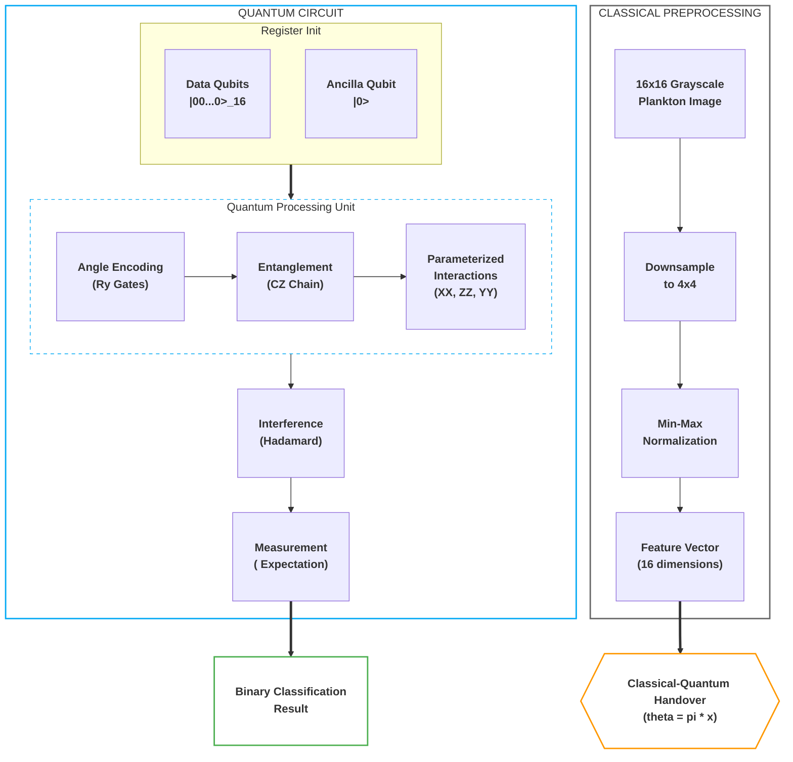

# quantum-mnist

This repository studies quantum image classification in two stages. It begins by reproducing a published MNIST-based demonstration of quantum image classification and then extends the analysis to plankton image data derived from *Deep Learning Classification of Lake Zooplankton* by S. Kyathanahally, T. Hardeman, E. Merz, T. Kozakiewicz, M. Reyes, P. Isles, F. Pomati, and M. Baity-Jesi (Eawag, August 12, 2021): https://arxiv.org/pdf/2108.05258.pdf

The central aim is not to claim an unrestricted quantum advantage, but to evaluate how parameterized quantum circuits behave under tightly controlled, low-resolution, low-parameter conditions relative to classical baselines. Across the later phases, the repository emphasizes statistical rigor, reproducibility, parameter matching, and careful comparison against established classical results.

For a concise operational guide, see `quickstart.md`.

Related reference:
https://arxiv.org/pdf/2011.02831.pdf

## Citation

If you use this repository or the underlying zooplankton benchmark in academic or technical work, the following BibTeX entries may be used.

```bibtex
@article{kyathanahally2021deep,
  title = {Deep Learning Classification of Lake Zooplankton},
  author = {Kyathanahally, S. and Hardeman, T. and Merz, E. and Kozakiewicz, T. and Reyes, M. and Isles, P. and Pomati, F. and Baity-Jesi, M.},
  year = {2021},
  month = aug,
  note = {Dated August 12, 2021},
  institution = {Eawag},
  address = {Uberlandstrasse 133, CH-8600 D{\"u}bendorf, Switzerland},
  eprint = {2108.05258},
  archivePrefix = {arXiv},
  primaryClass = {cs.CV},
  url = {https://arxiv.org/abs/2108.05258}
}

@misc{henry2026quantummnist,
  author = {Julian Henry},
  title = {quantum-mnist},
  year = {2026},
  organization = {Aeae.inc},
  address = {Houston, Texas},
  note = {Software repository}
}
```

## Project Structure

1. **Phase 1 - MNIST reproduction**: reproduces the original notebook-based MNIST demonstration in Google Colab.
2. **Phase 2 - Binary quantum classification**: evaluates binary plankton classification with 5-fold stratified cross-validation and bootstrap confidence intervals.
3. **Phase 3 - Hyperparameter optimization**: uses nested cross-validation to select robust hyperparameters without data leakage.
4. **Phase 4 - Classical comparison**: compares the binary QNN against classical baselines and against the EAWAG benchmark context reported by Kyathanahally et al. (2021).
5. **Phase 5 - Multi-class scaling**: studies performance as the number of classes increases from 2 to 16.
6. **Phase 6 - Quantum saliency**: analyzes which input regions drive quantum model decisions.
7. **Phase 7 - Expressibility and entanglement**: characterizes the production circuit through expressibility and entanglement metrics.

## Research Summary

The repository is organized as a progression from reproduction to controlled comparison. Phase 1 verifies the original MNIST demonstration. Phases 2 and 3 establish a more rigorous binary quantum workflow for plankton images, including bootstrap confidence intervals and nested cross-validation. Phase 4 then broadens the comparison to classical baselines under equalized sample budgets and parameter-aware controls. Phase 5 studies how the approach scales as class cardinality increases. Phases 6 and 7 shift from predictive performance to interpretability and circuit-level characterization.

Throughout the project, the working quantum representation remains deliberately constrained. Inputs are reduced to a `4x4` grayscale representation to make 16-qubit simulation tractable, and the most meaningful comparisons are therefore not against unconstrained state-of-the-art deep models, but against classical baselines trained under the same information and parameter restrictions.

## Phase 1: MNIST Reproduction

This phase reproduces the quantum MNIST notebook workflow and confirms that the original demonstration behaves as reported.

## Phase 2: Binary Quantum Classification

Phase 2 implements the binary quantum classifier in `phase2/binary_quantum_classifier.py`. The model uses **Angle Encoding** together with an expressive parameterized quantum circuit, and evaluation is performed with **5-fold stratified cross-validation**, deterministic fold seeding, and **bootstrap 95% confidence intervals**. Results are written to `phase2/results/phase2_results.json`.

### Phase 2 Results

From `phase2/results/phase2_results.json`:

- Mean accuracy: **38.44%** (+/- 4.13%)
- 95% bootstrap CI: **[35.49%, 42.50%]**
- Per-fold accuracies: **[0.3906, 0.4621, 0.3482, 0.3638, 0.3571]**

### Phase 2 Architecture

The classifier uses a hybrid classical-quantum pipeline in which grayscale plankton images are downsampled to a 16-dimensional representation and then encoded into a parameterized circuit.



Pixel intensities are encoded as `Ry(pi * x_i)` rotations so that grayscale information is preserved rather than thresholded away. A linear chain of `CZ` gates captures spatial correlations across the `4x4` representation, after which `XX`, `ZZ`, and `YY` interactions couple the data qubits to the readout qubit. The ancilla readout is optimized under hinge loss, which is compatible with the `[-1, 1]` expectation-value output of the circuit.

## Phase 3: Hyperparameter Optimization

Phase 3 implements nested model selection in `phase3/optimize_binary_classifier.py`. The outer loop provides an unbiased performance estimate, while the inner loop selects hyperparameters without touching held-out test folds. Results are stored in `phase3/results/phase3_results.json`.

### Selected Hyperparameters

| Parameter | Optimal Value | Rationale |
| :--- | :--- | :--- |
| **Encoding** | `Angle` | Preserves grayscale information lost in basis encoding. |
| **PQC Layers** | `1` | Deeper circuits showed signs of over-parameterization on small `4x4` inputs. |
| **Learning Rate** | `0.01` | Improved optimization stability under hinge loss. |
| **Batch Size** | `16` | Provided a practical balance between variance and convergence. |
| **Loss Function** | `Hinge` | Matches the expectation-value output range of the QNN. |

### Representative Binary Results

The tuned configuration consistently exceeded the 60% target on several biologically distinct plankton pairs.

| Plankton Pair | Sample A | Sample B | Accuracy | Status |
| :--- | :---: | :---: | :--- | :--- |
| **aphanizomenon vs bosmina** |  |  | **62.7%** | Target reached |
| **brachionus vs ceratium** |  |  | **73.9%** | Target reached |
| **chaoborus vs conochilus** |  |  | **92.1%** | Target reached |
| **copepod_skins vs cyclops** |  |  | **86.6%** | Target reached |
| **daphnia vs daphnia_skins** |  |  | **72.9%** | Target reached |
| **diaphanosoma vs diatom_chain** |  |  | **95.3%** | Target reached |

## Phase 4: Classical Comparison

Phase 4 asks a narrower and more defensible question than a direct comparison to full-resolution deep learning systems: how does a binary QNN constrained to a `4x4` input representation compare with a parameter-matched classical model and with the classical benchmark context reported in the EAWAG plankton study?

### Binary Comparison Results

<!-- P4_RESULTS_START -->
| Pair | QNN Accuracy | Fair Classical | P-Value | Significant? |
| --- | --- | --- | --- | --- |
| aphanizomenon_vs_leptodora | 57.2% | 55.1% | 0.5117 | False |
| asplanchna_vs_uroglena | 73.7% | 61.2% | 0.0691 | False |
| asterionella_vs_diaphanosoma | 63.8% | 55.3% | 0.0057 | False |
| asterionella_vs_rotifers | 58.9% | 55.4% | 0.2831 | False |
| asterionella_vs_uroglena | 86.0% | 59.4% | 0.0133 | False |
| bosmina_vs_brachionus | 75.9% | 62.2% | 0.0781 | False |
| bosmina_vs_polyarthra | 51.2% | 46.9% | 0.2056 | False |
| brachionus_vs_synchaeta | 53.0% | 53.0% | 0.9978 | False |
| ceratium_vs_cyclops | 49.5% | 53.6% | 0.1645 | False |
| conochilus_vs_daphnia | 73.3% | 70.1% | 0.2517 | False |
| conochilus_vs_fragilaria | 65.1% | 53.5% | 0.0778 | False |
| conochilus_vs_keratella_cochlearis | 70.2% | 68.9% | 0.3739 | False |
| conochilus_vs_trichocerca | 53.6% | 50.3% | 0.4479 | False |
| cyclops_vs_kellicottia | 62.5% | 61.7% | 0.4213 | False |
| daphnia_vs_kellicottia | 58.1% | 56.2% | 0.3285 | False |
| daphnia_vs_rotifers | 81.6% | 61.1% | 0.0173 | False |
| dinobryon_vs_nauplius | 68.8% | 61.1% | 0.3739 | False |
| eudiaptomus_vs_kellicottia | 51.6% | 53.3% | 0.1638 | False |
| eudiaptomus_vs_uroglena | 95.5% | 66.6% | 0.0002 | True |
| fragilaria_vs_keratella_cochlearis | 73.2% | 64.8% | 0.3739 | False |
| keratella_quadrata_vs_paradileptus | 60.9% | 52.8% | 0.0044 | False |
| keratella_quadrata_vs_rotifers | 63.9% | 63.1% | 0.3739 | False |
| keratella_quadrata_vs_uroglena | 72.0% | 69.6% | 0.3576 | False |
| leptodora_vs_paradileptus | 67.6% | 73.2% | 0.1493 | False |
| maybe_cyano_vs_nauplius | 53.1% | 56.3% | 0.3471 | False |
<!-- P4_RESULTS_END -->

### Aggregate Phase 4 Summary

The per-pair tests above are intentionally reported with caution because `n = 5` folds is underpowered for pairwise significance claims. The primary Phase 4 analysis therefore treats plankton pairs, rather than folds, as the unit of replication.

<!-- P4_AGGREGATE_START -->
| Metric | Value |
| --- | --- |
| Mean Delta (QNN − Fair) | +6.23% |
| Std Delta | 8.83% |
| Effect Size (Cohen's d) | 0.705 |
| One-sample t-test p | 0.0017 |
| Wilcoxon signed-rank p | 0.0007 |
| QNN Wins | 20 / 25 |
| Fair Classical Wins | 5 / 25 |
<!-- P4_AGGREGATE_END -->

### EAWAG Benchmark Context

Our primary external reference is *Deep Learning Classification of Lake Zooplankton* by **S. Kyathanahally, T. Hardeman, E. Merz, T. Kozakiewicz, M. Reyes, P. Isles, F. Pomati, and M. Baity-Jesi** (Eawag, 2021). That work reported **98% accuracy** on a 35-class problem using ensembles of DenseNet, ResNet, and MobileNet models at higher input resolution.

The comparison in this repository is more restricted. Rather than reproducing the full multi-class, high-resolution setting of the EAWAG study, Phase 4 compares the present binary QNN against the paper's reported feature-based MLP result (**91.2%**) under a strongly constrained `4x4` representation. This makes the comparison informative about low-information, parameter-constrained learning, but not directly equivalent to the full-resolution benchmark.

Further implementation details are documented in `phase4/README.md`.

## Phase 5: Multi-Class Scaling

Phase 5 extends the analysis to `k`-class classification with `k` ranging from 2 to 16. The emphasis is on how both quantum and classical models degrade as task complexity increases under the same compressed `4x4` representation.

### Phase 5 Results

<!-- P5_RESULTS_START -->
| K (Categories) | QNN (PCA 16) | Fair Classical (PCA 16) |
| --- | --- | --- |
| 2 | 71.0% | 68.8% |
| 3 | 54.5% | 55.6% |
| 4 | 46.1% | 47.8% |
| 5 | 37.8% | 40.5% |
| 8 | 30.2% | 31.8% |
| 12 | 23.4% | 25.7% |
| 16 | 18.3% | 21.7% |
<!-- P5_RESULTS_END -->

These results suggest that the quantum model remains competitive at low class counts, but the fair classical baseline becomes increasingly favorable as the task grows more complex. Additional details are available in `phase5/README.md`.

## Phase 6: Quantum Saliency

Phase 6 introduces gradient-based quantum saliency maps to examine which input regions most influence the QNN decision. This analysis provides an interpretability layer for the compressed `4x4` input regime and tests whether the model attends to biologically meaningful structure rather than arbitrary background artifacts.

The principal observations are that the QNN often concentrates on localized morphological cues, that the pipeline remains differentiable from classical preprocessing through quantum expectation values, and that the resulting maps provide a practical diagnostic for checking whether the learned decision function is biologically plausible. Additional examples are documented in `phase6/README.md`.

## Phase 7: Expressibility and Entanglement

Phase 7 analyzes the full **17-qubit production PQC** used in the later experiments: 16 data qubits arranged in a `4x4` grid together with one readout qubit. The analysis reports Meyer-Wallach entanglement and expressibility, quantified as KL divergence from the Haar-distributed reference, together with bootstrap 95% confidence intervals.

The goal of this phase is not merely descriptive. It provides a circuit-level rationale for how circuit depth changes the geometry of the reachable state space. In particular, increasing depth is expected to reduce KL divergence from the Haar distribution and increase global entanglement. The full discussion is available in `phase7/README.md`.

## Methodological Framework

All experimental phases after Phase 1 are designed around statistical rigor, matched comparisons, and reproducibility.

### Cross-Validation

- **Phases 2, 4, and 6** use stratified 5-fold cross-validation, with metrics reported as mean +/- standard deviation together with bootstrap 95% confidence intervals.
- **Phases 3 and 5** use nested cross-validation with `5` outer folds and `3` inner folds so that hyperparameter selection remains isolated from final evaluation.
- **Repeated runs** are supported through `N_REPEATS` and `BASE_SEED` for Phase 4 and Phase 5, allowing variability beyond a single fold partition to be quantified deterministically.

### Sample Equalization and Baselines

All principal comparisons are performed under equalized sample budgets. The `Q_SAMPLES` parameter is applied uniformly across models so that observed differences are not artifacts of unequal data exposure. Each experiment also reports majority-class and random baselines to contextualize absolute performance.

### Statistical Testing and Power

Per-pair tests are reported for transparency, but they are intrinsically underpowered at `n = 5` folds. For that reason, the primary Phase 4 inference treats class pairs as replication units and evaluates the distribution of pair-level accuracy differences (`QNN - Fair Classical`) through one-sample t-tests and Wilcoxon signed-rank tests.

The pair count itself is justified through `utils/power_analysis.py`. Because Wilcoxon cannot attain `p < 0.05` with only five folds per pair, aggregate testing across 25 pairs provides the meaningful inferential basis. At the pilot-observed effect size (`d ≈ 0.65`), this design yields approximately **88% power**.

| Pairs (m) | Power (d = 0.65) | Compute Time |
| :--- | :--- | :--- |
| 4 | 9% | ~1.0 hr |
| 10 | 42% | ~2.5 hrs |
| 15 | 64% | ~3.8 hrs |
| 20 | 80% | ~5.0 hrs |
| **25** | **88%** | **~6.2 hrs** |
| 30 | 93% | ~7.5 hrs |

Eligible binary pairs are chosen from 25 biological classes with at least 80 images each, excluding ambiguous or irrelevant categories such as `unknown`, `dirt`, `fish`, and `filament`. A deterministic greedy class-coverage algorithm with `seed = 42` ensures that all eligible classes appear while favoring balanced class sizes.

### Reproducibility

- Deterministic file ordering is enforced through sorted directory listings.
- Fold seeds are set as `42 + fold_id` across `numpy`, `tensorflow`, and Python's `random`.
- Package versions are pinned in the `Dockerfile`.
- Automated verification is built into the workflow through an 82-test suite spanning Phases 2 to 7.
- Each experiment run records its full configuration as JSON.

## Limitations

- **Quantum simulation only**: all circuits are evaluated in `tensorflow-quantum` on a classical simulator rather than on physical quantum hardware.
- **Severe resolution constraint**: the `4x4` representation is driven by simulation cost, so conclusions may not transfer directly to larger qubit counts or higher-resolution encodings.
- **Per-pair inferential weakness**: pairwise significance claims remain limited at `n = 5` folds, which is why the aggregate test is treated as primary.
- **Partial pair coverage**: 25 of 300 eligible class pairs are evaluated, which leaves residual uncertainty about broader pair-level generalization.
- **Restricted hyperparameter search**: the explored search space is intentionally small and may understate the best attainable performance of both classical and quantum models.
- **No augmentation and no hardware noise model**: these omissions simplify interpretation, but they also limit ecological validity for deployment-oriented conclusions.

## Reproducing the Experiments

For a short operational overview, see `quickstart.md`. The commands below summarize the main workflows in this repository.

### Build the Environment

```bash
docker build --platform linux/amd64 -t quantum-plankton .
```

The build pins dependencies and runs the automated verification suite. The expected dataset location is `data/zooplankton_0p5x/`.

### Main Experimental Runs

Phase 4 binary comparison:

```bash
docker run --rm --platform linux/amd64 \
  -v $(pwd)/phase4/results:/app/phase4/results \
  quantum-plankton \
  python phase4/run_experiments.py
```

Phase 5 multi-class scaling:

```bash
docker run --rm --platform linux/amd64 \
  -v $(pwd)/phase5/results:/app/phase5/results \
  quantum-plankton \
  python phase5/run_experiments.py
```

Phase 5 scientific comparison with progress bars:

```bash
docker run -it --rm --platform linux/amd64 \
  -v $(pwd)/phase5/results:/app/phase5/results \
  quantum-plankton \
  python phase5/scientific_comparison.py
```

Phase 2 binary quantum classifier:

```bash
docker run --rm --platform linux/amd64 \
  -e PYTHONUNBUFFERED=1 -e TF_THREADS=1 \
  -v $(pwd)/phase2/results:/app/phase2/results \
  quantum-plankton \
  python phase2/binary_quantum_classifier.py
```

Phase 3 nested hyperparameter search:

```bash
docker run --rm --platform linux/amd64 \
  -e PYTHONUNBUFFERED=1 -e TF_THREADS=1 \
  -v $(pwd)/phase3/results:/app/phase3/results \
  quantum-plankton \
  python phase3/optimize_binary_classifier.py
```

### Auxiliary Analyses

Power analysis:

```bash
docker run --rm --platform linux/amd64 \
  quantum-plankton python utils/power_analysis.py
```

Smoke test:

```bash
docker run --rm --platform linux/amd64 \
  -e SMOKE_TEST=true \
  -v $(pwd)/phase4/results:/app/phase4/results \
  quantum-plankton \
  python phase4/run_experiments.py
```

Standalone verification suite:

```bash
docker run --rm --platform linux/amd64 \
  quantum-plankton python -m pytest \
  phase2/test_rigor_phase2.py \
  phase3/test_rigor_phase3.py \
  phase4/test_rigor.py \
  phase5/test_rigor_phase5.py \
  phase6/test_rigor_phase6.py \
  phase7/test_rigor_phase7.py \
  -v
```

Phase 6 saliency analysis:

```bash
docker run --rm --platform linux/amd64 \
  -v $(pwd)/phase6/results:/app/phase6/results \
  quantum-plankton \
  python phase6/quantum_saliency.py
```

Phase 7 circuit analysis:

```bash
docker run --rm --platform linux/amd64 \
  -v $(pwd)/phase7:/app/phase7 \
  quantum-plankton \
  python phase7/quantum_rigor.py
```

### Configurable Parameters

All major experiments accept environment-variable overrides.

| Variable | Default | Description |
| :--- | :--- | :--- |
| `N_FOLDS` | `5` | Number of cross-validation folds |
| `N_REPEATS` | `1` | Number of repeated cross-validation runs |
| `BASE_SEED` | `42` | Base seed for deterministic fold shuffling |
| `Q_SAMPLES` | `200` (Phase 4) / `400` (Phase 5) | Maximum training samples, applied uniformly across models |
| `SMOKE_TEST` | `false` | Reduces the workload to a minimal validation run |
| `DATA_DIR` | `/app/data/zooplankton_0p5x` | Dataset path inside the container |
| `RESULTS_DIR` | `phase4/results` or `phase5/results` | Output directory |

### Reading the Outputs

- `phase4/results/experiment_summary.csv` contains per-pair aggregate metrics and corrected p-values.
- `phase4/results/aggregate_test.json` contains the primary pair-level aggregate comparison between the QNN and the fair classical baseline.
- `phase5/results/comprehensive_k_summary.csv` summarizes multi-class scaling performance across `k`.
- `phase6/results/` contains saliency images.
- `phase7/results_rigor.json` and `phase7/results_rigor.txt` contain expressibility and entanglement summaries.

## Thermal Guidance for Emulated Runs

AMD64 emulation on Apple Silicon can be thermally demanding. The repository therefore supports pacing controls such as `TF_THREADS`, `EPOCH_COOL`, `THERMAL_SLEEP`, and `BREATHE_SLEEP`. A conservative example for long runs is:

```bash
docker run -it --rm --platform linux/amd64 \
  -e PYTHONUNBUFFERED=1 -e TF_THREADS=1 \
  -e EPOCH_COOL=3.0 -e THERMAL_SLEEP=60 \
  -v $(pwd)/phase4/results:/app/phase4/results \
  quantum-plankton python phase4/run_experiments.py
```

Increasing `EPOCH_COOL` or `THERMAL_SLEEP` reduces thermal load, while modestly increasing `TF_THREADS` can improve speed if thermal headroom permits.
