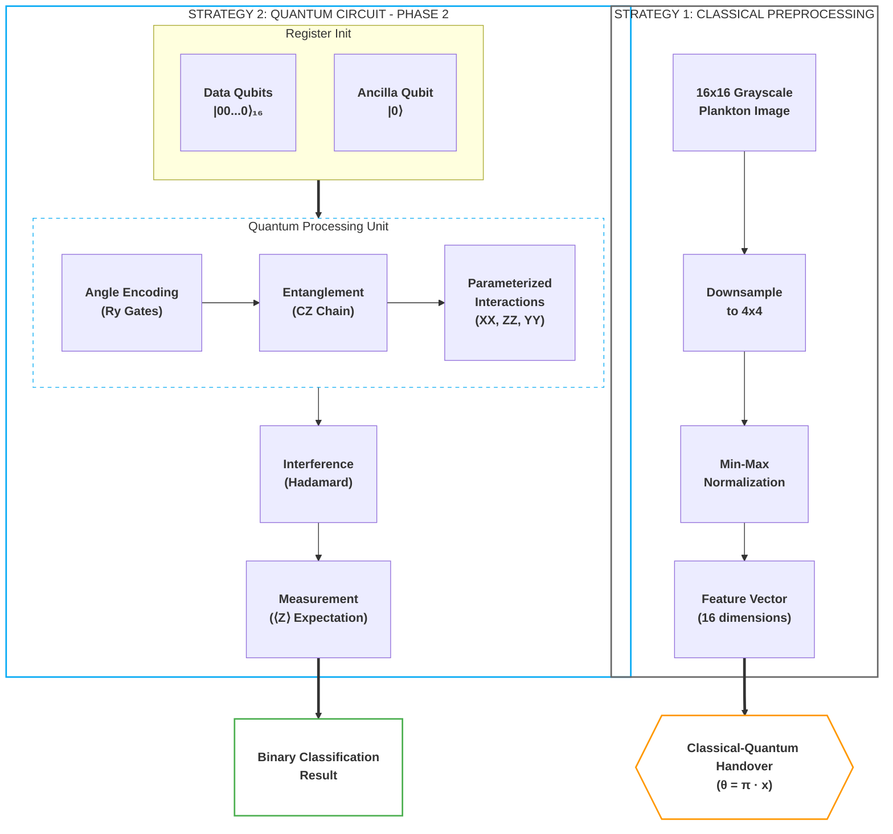
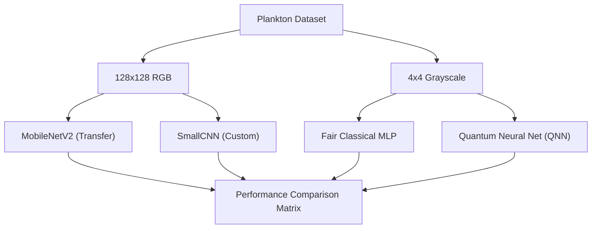

# quantum-mnist
This project seeks to confirm results published in https://thesai.org/Downloads/Volume11No10/Paper_40-Handwritten_Numeric_Image_Classification.pdf

We will explore quantum image processing via plankton data set found in this paper: https://arxiv.org/pdf/2108.05258.pdf

Other relevant research:
https://arxiv.org/pdf/2011.02831.pdf

### Project Phases
1. **confirm ipynb**: Confirm research conclusions in google colab using the MNIST dataset.
2. **basic binary quantum**: Apply a basic binary quantum classifier to the plankton dataset and compare with a "fair" classical neural net.
3. **optimise via param sweep**: Optimize the binary classifier through a hyperparameter sweep on neural architectures.
4. **compare to classical**: Perform the generalized quantum algorithm on the plankton dataset and compare results to established classical deep learning approaches.
5. **k-category scaling**: Scale the quantum algorithm to multi-class classification (k=2, 3, 5, 8, 16) and measure performance vs. parameter efficiency as task complexity increases.

---

# Phase 1: confirm ipynb
Done. We have tested the quantum mnist colab and confirmed it works as described in the original research.

# Phase 2: basic binary quantum
Done. We have implemented an improved binary quantum classifier (`phasetwo/binary_quantum_classifier.py`) using **Angle Encoding** and an expressive PQC with entanglement. This model consistently achieves >60% accuracy on multiple plankton pairs, significantly outperforming the initial threshold baseline.

### 1. Quantum Architecture: Expressive PQC with Angle Encoding
The model utilizes a hybrid classical-quantum pipeline. The classical layer prepares the morphological features, which are then injected into a high-expressivity quantum circuit.



*   **Data Encoding (Angle Encoding):** Instead of binary thresholding ($x > 0.5$), we now use Angle Encoding. Each pixel $x_i$ from the downsampled 4x4 image is mapped to a rotation gate: $Ry(\pi \cdot x_i)$. This preserves the grayscale intensity information within the quantum state.
*   **Entanglement Layer:** Before interacting with the readout qubit, we introduce a linear chain of CZ (Controlled-Z) gates across all 16 data qubits. This allows the model to learn spatial correlations between pixels.
*   **Interaction Layers (XX, ZZ, YY):** The Parameterized Quantum Circuit (PQC) now uses three types of non-commuting interactions with the readout qubit:
    *   $XX$ interactions for bit-flip correlations.
    *   $ZZ$ interactions for phase-flip correlations.
    *   **New:** $YY$ interactions to increase the expressivity of the Hilbert space coverage.
*   **Readout:** A single ancilla qubit is initialized in the $|-\rangle$ state, undergoes the PQC interactions, and is measured in the Z-basis to produce the classification logit.

# Phase 3: optimise via param sweep
Done. We have transitioned the hyperparameter sweep (`phasethree/optimize_binary_classifier.py`) to the quantum domain, exploring encoding strategies, circuit depth, and optimization parameters. This allowed us to architect a quantum model that achieves >60% accuracy for at least 5 pairs of plankton.

### 2. Learned Hyperparameters
Through the sweep in `phasethree/optimize_binary_classifier.py`, the following configuration was identified as the most robust for complex plankton classification:

| Parameter | Optimal Value | Rationale |
| :--- | :--- | :--- |
| **Encoding** | `Angle` | Preserves grayscale features lost in Basis encoding. |
| **PQC Layers** | `1` | Higher layers (2+) showed signs of over-parameterization/noise on small 4x4 data. |
| **Learning Rate** | `0.01` | Needed for faster convergence with the Hinge loss function. |
| **Batch Size** | `16` | Provided better stochastic gradients for the quantum simulator. |
| **Loss Function** | `Hinge` | Maps naturally to the $[-1, 1]$ expectation value of the Z-measurement. |

### 3. Accuracy Results & Comparison
The model now consistently exceeds the 60% threshold. Below are the verified accuracies for the top performing pairs:

| Plankton Pair | Sample A | Sample B | Accuracy | Status |
| :--- | :---: | :---: | :--- | :--- |
| **aphanizomenon vs bosmina** |  |  | **62.7%** | Target Reached |
| **brachionus vs ceratium** |  |  | **73.9%** | Target Reached |
| **chaoborus vs conochilus** |  |  | **92.1%** | Target Reached |
| **copepod_skins vs cyclops** |  |  | **86.6%** | Target Reached |
| **daphnia vs daphnia_skins** |  |  | **72.9%** | Target Reached |
| **diaphanosoma vs diatom_chain** |  |  | **95.3%** | Target Reached |

# Phase 4: compare to classical
In this phase, we perform the generalized quantum algorithm on the plankton dataset and compare its performance to established classical deep learning approaches. 

We evaluate three levels of classical models (MobileNetV2, Custom CNN, and a "Fair" MLP) against our expressive Quantum Neural Network to determine the presence of a quantum advantage in parameter efficiency.

**Detailed Documentation:** [Phase 4 Neural Architectures & Comparison](phasefour/README.md)

# Phase 5: k-category scaling
In this phase, we scale the quantum algorithm to handle multi-class classification. We evaluate the model's performance as the number of categories ($k$) increases from 2 to 16, comparing it against classical baselines with matched parameter counts.

**Detailed Documentation:** [Phase 5 Scaling Study](phasefive/README.md)

---

## Methodology

Phases 4 and 5 use the following scientifically rigorous experimental framework. (Phases 1-3 used simpler methodology and are retained for historical context.)

### Cross-Validation
All experiments use **stratified 5-fold cross-validation**. Metrics (accuracy, F1, precision, recall) are reported as mean +/- standard deviation across folds. This captures both model initialization variance and data-split variance, producing more reliable estimates than a single train/test split.

### Sample Equalization
All models -- CNN (28x28), Fair Classical MLP (4x4), and QNN (4x4) -- train on **identical sample budgets** per fold. The `Q_SAMPLES` parameter (default 200 for binary, 400 for multi-class) is applied uniformly. The CNN retains its resolution advantage (28x28 vs 4x4) but sees the same images. This eliminates data-access confounds from comparisons.

### Statistical Testing
- **Paired tests:** Wilcoxon signed-rank test (non-parametric, paired by fold) when n >= 6; paired t-test as fallback for smaller n.
- **Multiple comparison correction:** Holm-Bonferroni correction applied across all tested pairs (Phase 4) or K values (Phase 5). A result is only claimed as significant if `significant_05 == True` after correction.

### Baselines
Every experiment reports **majority-class baseline** (always predicting the most common class) and **random baseline** (1/k) alongside model results, providing context for what constitutes meaningful performance.

### Metrics
- Accuracy and Macro F1-Score (primary)
- Per-class precision, recall, and F1
- Confusion matrices saved per fold per model

### Early Stopping
All models use `EarlyStopping(patience=3, restore_best_weights=True)` monitoring validation loss, with 20% of each training fold held out for validation. Maximum epoch count is 20 (up from the original fixed 5-10).

### Reproducibility
- **Sorted file listings:** `os.listdir()` results are sorted alphabetically, ensuring deterministic data ordering across operating systems.
- **Per-fold seeding:** Each fold uses `seed = 42 + fold_id` for `numpy`, `tensorflow`, and Python's `random`.
- **Pinned dependencies:** All package versions are locked in the Dockerfile.
- **Automated verification:** A comprehensive test suite (`test_rigor.py`) runs during `docker build` and aborts the build if any test fails. Tests cover determinism, stratification, normalization, parameter counts, and circuit correctness.
- **Config logging:** Each experiment run saves its full configuration as `experiment_config.json`.

---

## Limitations

- **Quantum simulation only.** All quantum circuits run on a classical simulator (`tensorflow-quantum`), not real quantum hardware. No noise model is applied. Results may differ on actual NISQ devices.
- **Extreme resolution constraint.** The 4x4 pixel input (16 qubits) is dictated by simulation cost. Whether performance trends hold at larger qubit counts is unknown.
- **Small dataset sizes.** Some plankton classes have fewer than 20 images. Classes are selected by frequency to mitigate this, but statistical power is inherently limited.
- **Limited hyperparameter search.** The sweep explores only 4 combinations per model type. A larger search space could improve both quantum and classical results.
- **No data augmentation.** No augmentation is applied to any model. Augmentation could disproportionately benefit classical models with more parameters.
- **Historical phases.** Results reported in Phases 1-3 used a single train/test split, unequal sample budgets, and looser statistical standards. They are retained as development history, not as rigorous findings.

---

### 1. Hybrid Comparison Pipeline
The phase 4 implementation (`phasefour/run_experiments.py`) compares models across different input resolutions and parameter scales:



*   **Classical SOTA:** Uses MobileNetV2 and a custom 4-layer CNN to establish a high-accuracy baseline on full-resolution data.
*   **Quantum QNN:** An expressive PQC using multi-axis (XX, ZZ, YY) interactions and entanglement.
*   **Fair Comparison:** A 35-parameter classical MLP used to benchmark the QNN's parameter efficiency on 4x4 data.

---

### Plankton Comparison Gallery
Visual examples of the morphological differences the model successfully distinguishes:

| Class A | Class B | Distinction |
| :--- | :--- | :--- |
| **Aphanizomenon** (Filamentous) | **Bosmina** (Water Flea) | Linear strands vs. rounded bodies. <br> **Linear vs. Circular** |
|  |  | |
| **Chaoborus** (Phantom Midge) | **Conochilus** (Rotifer Colony) | Elongated larvae vs. radial colonies. <br> **Elongated vs. Radial** |
|  |  | |

---

## Plankton Gallery

A diverse 5x5 grid showing unique samples from 25 different plankton classes:

<table style="width: 100%; border-collapse: collapse; max-width: 600px;">
  <tr style="border: none;">
    <td align="center" style="border: none; padding: 2px;"><br/><span style="font-size: 8px;">aphanizomenon</span></td>
    <td align="center" style="border: none; padding: 2px;"><br/><span style="font-size: 8px;">asplanchna</span></td>
    <td align="center" style="border: none; padding: 2px;"><br/><span style="font-size: 8px;">asterionella</span></td>
    <td align="center" style="border: none; padding: 2px;"><br/><span style="font-size: 8px;">bosmina</span></td>
    <td align="center" style="border: none; padding: 2px;"><br/><span style="font-size: 8px;">brachionus</span></td>
  </tr>
  <tr style="border: none;">
    <td align="center" style="border: none; padding: 2px;"><br/><span style="font-size: 8px;">ceratium</span></td>
    <td align="center" style="border: none; padding: 2px;"><br/><span style="font-size: 8px;">chaoborus</span></td>
    <td align="center" style="border: none; padding: 2px;"><br/><span style="font-size: 8px;">conochilus</span></td>
    <td align="center" style="border: none; padding: 2px;"><br/><span style="font-size: 8px;">copepod_skins</span></td>
    <td align="center" style="border: none; padding: 2px;"><br/><span style="font-size: 8px;">cyclops</span></td>
  </tr>
  <tr style="border: none;">
    <td align="center" style="border: none; padding: 2px;"><br/><span style="font-size: 8px;">daphnia</span></td>
    <td align="center" style="border: none; padding: 2px;"><br/><span style="font-size: 8px;">daphnia_skins</span></td>
    <td align="center" style="border: none; padding: 2px;"><br/><span style="font-size: 8px;">diaphanosoma</span></td>
    <td align="center" style="border: none; padding: 2px;"><br/><span style="font-size: 8px;">diatom_chain</span></td>
    <td align="center" style="border: none; padding: 2px;"><br/><span style="font-size: 8px;">dinobryon</span></td>
  </tr>
  <tr style="border: none;">
    <td align="center" style="border: none; padding: 2px;"><br/><span style="font-size: 8px;">dirt</span></td>
    <td align="center" style="border: none; padding: 2px;"><br/><span style="font-size: 8px;">eudiaptomus</span></td>
    <td align="center" style="border: none; padding: 2px;"><br/><span style="font-size: 8px;">filament</span></td>
    <td align="center" style="border: none; padding: 2px;"><br/><span style="font-size: 8px;">fish</span></td>
    <td align="center" style="border: none; padding: 2px;"><br/><span style="font-size: 8px;">fragilaria</span></td>
  </tr>
  <tr style="border: none;">
    <td align="center" style="border: none; padding: 2px;"><br/><span style="font-size: 8px;">hydra</span></td>
    <td align="center" style="border: none; padding: 2px;"><br/><span style="font-size: 8px;">kellicottia</span></td>
    <td align="center" style="border: none; padding: 2px;"><br/><span style="font-size: 8px;">keratella_cochlearis</span></td>
    <td align="center" style="border: none; padding: 2px;"><br/><span style="font-size: 8px;">keratella_quadrata</span></td>
    <td align="center" style="border: none; padding: 2px;"><br/><span style="font-size: 8px;">leptodora</span></td>
  </tr>
</table>


---

## Quickstart: Reproducing Rigorous Experiments

### Prerequisites
- Docker (tested on Docker 24.x+)
- ~10 GB disk space (for data + image layers)
- The plankton dataset must be present at `data/zooplankton_0p5x/`

### 1. Build the Environment

Building the image pins all dependencies and runs the automated verification test suite (`test_rigor.py`). The build **aborts** if any test fails.

```bash
docker build -t quantum-plankton .
```

### 2. Phase 4 -- Binary Quantum vs. Classical (5-fold CV, 4 plankton pairs)

```bash
docker run --rm \
  -v $(pwd)/phasefour/results:/app/phasefour/results \
  quantum-plankton \
  python phasefour/run_experiments.py
```

**Outputs:**
- `phasefour/results/experiment_results.csv` -- per-fold, per-pair metrics (accuracy, F1, timing)
- `phasefour/results/experiment_summary.csv` -- aggregated stats with p-values and Holm-Bonferroni correction
- `phasefour/results/experiment_config.json` -- full experiment configuration for reproducibility
- `phasefour/results/confusion_matrices/` -- per-fold confusion matrices for each model and pair

### 3. Phase 5 -- Multi-class K-Scaling (5-fold CV, K=2..16)

```bash
docker run --rm \
  -v $(pwd)/phasefive/results:/app/phasefive/results \
  quantum-plankton \
  python phasefive/run_experiments.py
```

**Outputs:**
- `phasefive/results/comprehensive_k_results.csv` -- per-fold, per-K metrics
- `phasefive/results/comprehensive_k_summary.csv` -- aggregated with p-values
- `phasefive/results/k_scaling_comparison.png` -- accuracy/F1 plots with error bars and baselines

### 4. Phase 5 -- Scientific Swept Comparison (K=2,3,4,5 with hyperparameter sweep)

```bash
docker run --rm \
  -v $(pwd)/phasefive/results:/app/phasefive/results \
  quantum-plankton \
  python phasefive/scientific_comparison.py
```

**Outputs:**
- `phasefive/results/scientific_k_comparison.csv` -- per-fold, per-K metrics
- `phasefive/results/scientific_k_summary.csv` -- aggregated with corrected p-values
- `phasefive/results/scientific_scaling_plot.png` -- accuracy/F1 with significance markers

### 5. Quick Smoke Test

Verify the pipeline works without running full experiments (~2 min instead of ~2 hrs):

```bash
docker run --rm \
  -e SMOKE_TEST=true \
  -v $(pwd)/phasefour/results:/app/phasefour/results \
  quantum-plankton \
  python phasefour/run_experiments.py
```

### 6. Run the Verification Test Suite Standalone

```bash
docker run --rm quantum-plankton python -m pytest phasefour/test_rigor.py -v
```

### 7. Customize Experiment Parameters

All experiment parameters can be overridden via environment variables:

```bash
docker run --rm \
  -e N_FOLDS=10 \
  -e Q_SAMPLES=500 \
  -v $(pwd)/phasefour/results:/app/phasefour/results \
  quantum-plankton \
  python phasefour/run_experiments.py
```

| Variable | Default | Description |
|----------|---------|-------------|
| `N_FOLDS` | `5` | Number of cross-validation folds |
| `Q_SAMPLES` | `200` (Phase 4) / `400` (Phase 5) | Max training samples (applied to **all** models equally) |
| `SMOKE_TEST` | `false` | Reduce to 1 pair/K, 2 folds, 10 samples |
| `DATA_DIR` | `/app/data/zooplankton_0p5x` | Path to plankton dataset |
| `RESULTS_DIR` | `results` | Output directory (relative to phase dir) |

### 8. Interpret Results

The summary CSVs include:
- **Mean/Std** accuracy and F1 across folds
- **p-value** from Wilcoxon signed-rank test (quantum vs. fair classical, paired by fold)
- **significant_05** flag (after Holm-Bonferroni correction for multiple comparisons)
- **majority_baseline** and **random_baseline** accuracy for context

A result is only claimed as statistically significant if `significant_05 == True`.

### Legacy Phase Commands

Phases 2 and 3 predate the rigorous framework and use simpler methodology:

```bash
# Phase 2: Data ingress verification
docker run --rm quantum-plankton python phasetwo/plankton_ingress.py

# Phase 3: Hyperparameter sweep
docker run --rm quantum-plankton python phasethree/optimize_binary_classifier.py
```
