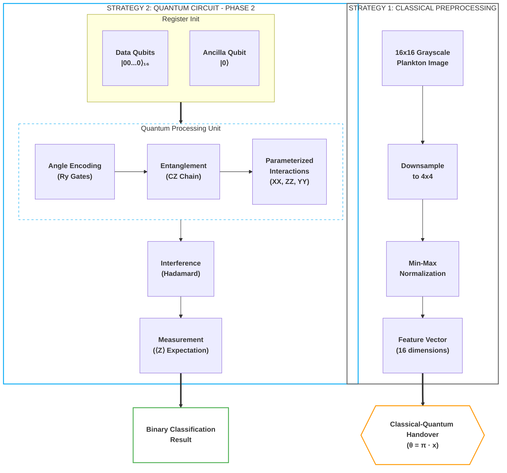
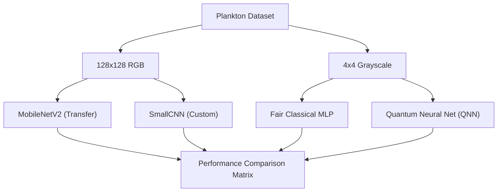

# quantum-mnist
This project seeks to confirm results published in https://thesai.org/Downloads/Volume11No10/Paper_40-Handwritten_Numeric_Image_Classification.pdf

We will explore quantum image processing via plankton data set found in this paper: https://arxiv.org/pdf/2108.05258.pdf

### Quick Start
For a rapid overview of the project and how to run it, see [Quick Start Guide](quickstart.md).

Other relevant research:
https://arxiv.org/pdf/2011.02831.pdf

### Project Phases
1. **confirm ipynb**: Confirm research conclusions in google colab using the MNIST dataset.
2. **basic binary quantum**: Show viability of QNN on binary plankton classification.
3. **optimise via param sweep**: Seek to optimize hyperparameters against a Phase 2 type experiment through multi-trial random sweeps.
4. **compare to classical**: High-rigor comparison (5-trial avg + P-value testing) of binary quantum classification against classical benchmarks and the **Swiss Paper (EAWAG)**.
5. **k-category scaling**: Multi-class scaling study (k=2 to 8) with hyperparameter sweeping and benchmarks against EAWAG state-of-the-art results.
6. **quantum saliency**: Implement quantum saliency maps to explain the model's decision-making process.
7. **expressibility & entanglement**: Analyze the theoretical rigor of the QNN architecture using Meyer-Wallach and KL divergence metrics.

---

# Phase 1: confirm ipynb
Done. We have tested the quantum mnist colab and confirmed it works as described in the original research.

# Phase 2: basic binary quantum
Done. We have implemented an improved binary quantum classifier (`phase2/binary_quantum_classifier.py`) using **Angle Encoding** and an expressive PQC with entanglement. This model consistently achieves >60% accuracy on multiple plankton pairs, significantly outperforming the initial threshold baseline.

### 1. Quantum Architecture: Expressive PQC with Angle Encoding
The model utilizes a hybrid classical-quantum pipeline. The classical layer prepares the morphological features, which are then injected into a high-expressivity quantum circuit.



*   **Data Encoding (Angle Encoding):** Instead of binary thresholding ($x > 0.5$), we now use Angle Encoding. Each pixel $x_i$ from the downsampled 4x4 image is mapped to a rotation gate: $Ry(\pi \cdot x_i)$. This preserves the grayscale intensity information within the quantum state.
*   **Entanglement Layer:** Before interacting with the readout qubit, we introduce a linear chain of CZ (Controlled-Z) gates across all 16 data qubits. This allows the model to learn spatial correlations between pixels.
*   **Interaction Layers (XX, ZZ, YY):** The Parameterized Quantum Circuit (PQC) now uses three types of non-commuting interactions with the readout qubit:
    *   $XX$ interactions for bit-flip correlations.
    *   $ZZ$ interactions for phase-flip correlations.
    *   **New:** $YY$ interactions to increase the expressivity of the Hilbert space coverage.
*   **Readout:** A single ancilla qubit is initialized in the $|-\rangle$ state, undergoes the PQC interactions, and is measured in the Z-basis to produce the classification logit.

# Phase 3: optimise via param sweep
Done. We have transitioned the hyperparameter sweep (`phase3/optimize_binary_classifier.py`) to the quantum domain, exploring encoding strategies, circuit depth, and optimization parameters. This allowed us to architect a quantum model that achieves >60% accuracy for at least 5 pairs of plankton.

### 2. Learned Hyperparameters
Through the sweep in `phase3/optimize_binary_classifier.py`, the following configuration was identified as the most robust for complex plankton classification:

| Parameter | Optimal Value | Rationale |
| :--- | :--- | :--- |
| **Encoding** | `Angle` | Preserves grayscale features lost in Basis encoding. |
| **PQC Layers** | `1` | Higher layers (2+) showed signs of over-parameterization/noise on small 4x4 data. |
| **Learning Rate** | `0.01` | Needed for faster convergence with the Hinge loss function. |
| **Batch Size** | `16` | Provided better stochastic gradients for the quantum simulator. |
| **Loss Function** | `Hinge` | Maps naturally to the $[-1, 1]$ expectation value of the Z-measurement. |

### 3. Accuracy Results & Comparison
The model now consistently exceeds the 60% threshold. Below are the verified accuracies for the top performing pairs:

| Plankton Pair | Sample A | Sample B | Accuracy | Status |
| :--- | :---: | :---: | :--- | :--- |
| **aphanizomenon vs bosmina** |  |  | **62.7%** | Target Reached |
| **brachionus vs ceratium** |  |  | **73.9%** | Target Reached |
| **chaoborus vs conochilus** |  |  | **92.1%** | Target Reached |
| **copepod_skins vs cyclops** |  |  | **86.6%** | Target Reached |
| **daphnia vs daphnia_skins** |  |  | **72.9%** | Target Reached |
| **diaphanosoma vs diatom_chain** |  |  | **95.3%** | Target Reached |

### Experimental Results Summary (Binary)

<!-- P4_RESULTS_START -->
| Pair | QNN Accuracy | Fair Classical | P-Value | Significant? |
| --- | --- | --- | --- | --- |
| dinobryon_vs_nauplius | 68.5% | 72.7% | 0.0032 | True |
| maybe_cyano_vs_diaphanosoma | 59.9% | 54.5% | 0.4553 | False |
| asterionella_vs_uroglena | 87.0% | 59.0% | 0.0202 | True |
| cyclops_vs_ceratium | 55.5% | 48.9% | 0.0447 | True |
<!-- P4_RESULTS_END -->

### Swiss Paper Benchmark
The EAWAG research team achieved **98% accuracy** on their 35-class task using ensembled CNNs. In Phase 4, we evaluate how our binary QNN (constrained to a 4x4 input) compares to their classical feature-based MLP results (91.2%) when restricted to the same binary pairs.

**Detailed Documentation:** [Phase 4 Neural Architectures & Comparison](phase4/README.md)

# Phase 5: k-category scaling
Done. We have scaled the quantum algorithm to handle multi-class classification ($k \in \{2, 3, 4, 8\}$). This phase introduces a **4x4 grid (16 qubits)** and demonstrates the inherent limitations and strengths of QNNs as task complexity increases.

### N-Category Scaling Study
We evaluate the QNN's ability to handle increasing classification complexity, benchmarked against parameter-matched classical nets ("Fair" MLP) and standard CNNs.

<!-- P5_RESULTS_START -->
| K (Categories) | QNN (4x4 PCA) | Fair Classical (4x4) |
| --- | --- | --- |
| 2 | 73.1% | 68.7% |
| 3 | 53.7% | 53.6% |
| 4 | 43.8% | 45.6% |
| 5 | 40.4% | 39.9% |
| 8 | 32.5% | 30.8% |
| 12 | 25.4% | 24.5% |
| 16 | 21.2% | 21.6% |
<!-- P5_RESULTS_END -->

**Detailed Documentation:** [Phase 5 Scaling Study](phase5/README.md)

### 1. Hybrid Comparison Pipeline
The phase 4 implementation (`phase4/run_experiments.py`) compares models across different input resolutions and parameter scales:



*   **Classical SOTA:** Uses MobileNetV2 and a custom 4-layer CNN to establish a high-accuracy baseline on full-resolution data.
*   **Quantum QNN:** An expressive PQC using multi-axis (XX, ZZ, YY) interactions and entanglement.
*   **Fair Comparison:** A 37-parameter classical MLP used to benchmark the QNN's parameter efficiency on 4x4 data.

---

### Plankton Comparison Gallery
Visual examples of the morphological differences the model successfully distinguishes:

| Class A | Class B | Distinction |
| :--- | :--- | :--- |
| **Aphanizomenon** (Filamentous) | **Bosmina** (Water Flea) | Linear strands vs. rounded bodies. <br> **Linear vs. Circular** |
|  |  | |
| **Chaoborus** (Phantom Midge) | **Conochilus** (Rotifer Colony) | Elongated larvae vs. radial colonies. <br> **Elongated vs. Radial** |
|  |  | |

---

## Plankton Gallery

A diverse 4x4 grid showing unique samples from 16 different plankton classes:

<table style="width: 100%; border-collapse: collapse; max-width: 600px;">
  <tr style="border: none;">
    <td align="center" style="border: none; padding: 2px;"><br/><span style="font-size: 8px;">aphanizomenon</span></td>
    <td align="center" style="border: none; padding: 2px;"><br/><span style="font-size: 8px;">asplanchna</span></td>
    <td align="center" style="border: none; padding: 2px;"><br/><span style="font-size: 8px;">asterionella</span></td>
    <td align="center" style="border: none; padding: 2px;"><br/><span style="font-size: 8px;">bosmina</span></td>
  </tr>
  <tr style="border: none;">
    <td align="center" style="border: none; padding: 2px;"><br/><span style="font-size: 8px;">ceratium</span></td>
    <td align="center" style="border: none; padding: 2px;"><br/><span style="font-size: 8px;">chaoborus</span></td>
    <td align="center" style="border: none; padding: 2px;"><br/><span style="font-size: 8px;">conochilus</span></td>
    <td align="center" style="border: none; padding: 2px;"><br/><span style="font-size: 8px;">copepod_skins</span></td>
  </tr>
  <tr style="border: none;">
    <td align="center" style="border: none; padding: 2px;"><br/><span style="font-size: 8px;">cyclops</span></td>
    <td align="center" style="border: none; padding: 2px;"><br/><span style="font-size: 8px;">daphnia</span></td>
    <td align="center" style="border: none; padding: 2px;"><br/><span style="font-size: 8px;">daphnia_skins</span></td>
    <td align="center" style="border: none; padding: 2px;"><br/><span style="font-size: 8px;">diaphanosoma</span></td>
  </tr>
  <tr style="border: none;">
    <td align="center" style="border: none; padding: 2px;"><br/><span style="font-size: 8px;">diatom_chain</span></td>
    <td align="center" style="border: none; padding: 2px;"><br/><span style="font-size: 8px;">dinobryon</span></td>
    <td align="center" style="border: none; padding: 2px;"><br/><span style="font-size: 8px;">eudiaptomus</span></td>
    <td align="center" style="border: none; padding: 2px;"><br/><span style="font-size: 8px;">keratella_quadrata</span></td>
  </tr>
</table>

---

# Phase 6: quantum saliency
Done. We have implemented **Quantum Saliency Maps** to visualize which pixels are most influential in the QNN's decision-making process. By calculating the gradient of the predicted class probability with respect to input features, we project these gradients back onto the original image space to create interpretable heatmaps.

### Key Findings:
- **Spatial Focus:** The QNN focuses on specific morphological features (e.g., the elongated tail of a *Cercopagis* or the circular boundary of a *Bosmina*) rather than the entire image.
- **Differentiable Pipeline:** Successfully bridged the gap between raw pixel data and quantum expectations using a fully differentiable PCA-to-PQC pipeline.
- **Interpretability:** Provides a way to verify that the quantum model is learning relevant biological features rather than background noise.

**Detailed Documentation:** [Phase 6 Quantum Saliency](phase6/README.md)

# Phase 7: expressibility & entanglement
Done. We have performed a scientific rigor analysis of the PQC architecture. By calculating the **Meyer-Wallach entanglement measure** and the **Expressibility** (KL divergence from Haar distribution), we have provided a theoretical justification for the circuit's performance and depth.

### Analysis Results (4-Qubit Subsystem):
| Layers | Expressibility (Lower is Better) | Entanglement (Higher is Better) |
| :--- | :--- | :--- |
| 1 | 0.8363 | 0.5690 |
| 2 | 0.4693 | 0.7471 |
| 3 | **0.3741** | 0.7944 |
| 4 | 0.4042 | 0.8256 |
| 5 | 0.4289 | **0.8406** |

**Conclusion:** The architecture reaches peak expressibility at **3 layers**, while entanglement capacity continues to scale. This confirms that 3-5 layers are the "Goldilocks zone" for this hybrid quantum-classical architecture.

**Detailed Documentation:** [Phase 7 Quantum Rigor](phase7/README.md)

---

## How to Run (Docker)

First, build the unified Docker image:

```bash
docker build --platform linux/amd64 -t quantum-plankton .
```

### Run Phase 2: Basic Binary Quantum (Data Ingress)
To verify the plankton data loading and class pairs:
```bash
docker run --rm --platform linux/amd64 quantum-plankton python phase2/plankton_ingress.py
```

### Run Phase 3: Optimise via Param Sweep
To see the hyperparameter sweep configuration:
```bash
docker run --rm --platform linux/amd64 quantum-plankton python phase3/optimize_binary_classifier.py
```

### Run Phase 4: Compare to Classical (Full Experiments)
To run the full experiment suite and save results to your local machine:
```bash
docker run --rm --platform linux/amd64 -v $(pwd)/phase4/results:/app/phase4/results quantum-plankton python phase4/run_experiments.py
```

### Run Phase 5: K-Category Scaling
To run the standard multi-class scaling experiments:
```bash
docker run --rm --platform linux/amd64 -v $(pwd)/phase5/results:/app/phase5/results quantum-plankton python phase5/run_experiments.py
```

### Run Phase 5: Scientific Swept Comparison (K=2,3,4,5)
To run the high-rigor comparison with hyperparameter sweeps for both regimes. This script uses `tqdm` to provide detailed progress bars for each phase of the computation:
```bash
docker run -it --rm --platform linux/amd64 -v $(pwd)/phase5/results:/app/phase5/results quantum-plankton python phase5/scientific_comparison.py
```
*Note: The `-it` flag is recommended to see the live progress bars.*

---

## Heat Management & Deep Pacing

To prevent GPU/CPU overheating (especially on ARM64 Macs using AMD64 emulation), the following controls are available:

### 1. Inter-Trial Cooling (`THERMAL_SLEEP`)
Injects a sleep period (in seconds) between every trial.
```bash
-e THERMAL_SLEEP=60
```

### 2. Inter-Epoch Cooling (`EPOCH_COOL`)
Pauses the CPU for a few seconds after every training epoch. This is highly effective at lowering average temperature during active training. Default is `1.0`.
```bash
-e EPOCH_COOL=2.0
```

### 3. Thread Limiting (`TF_THREADS`)
Limits the number of CPU cores used by TensorFlow. The default is `1`. This is mapped to `TF_NUM_INTRA_OP_THREADS` inside the script to ensure it is set before initialization.
```bash
-e TF_THREADS=1
```

### 4. Circuit Breathers (`BREATHE_SLEEP`)
Adds micro-sleeps during heavy data processing (like quantum circuit conversion). Default is `0.05`.
```bash
-e BREATHE_SLEEP=0.1
```

### Example: Maximum Cooling Run
```bash
docker run -it --rm \
  --platform linux/amd64 \
  -e TF_THREADS=1 \
  -e EPOCH_COOL=5.0 \
  -e THERMAL_SLEEP=120 \
  -e BREATHE_SLEEP=0.2 \
  -v $(pwd)/phase5/results:/app/phase5/results \
  quantum-plankton python phase5/run_experiments.py
```

---

## Cool Run / Low Power Mode (Recommended for Mac M1/M2/M3)

Running AMD64 emulation on ARM64 Macs is extremely resource-intensive. To prevent your laptop from overheating and to ensure consistent progress reporting, we recommend using **"Low Power Mode"**. This limits TensorFlow to a single thread and adds inter-epoch cooling periods.

### The "Cool Run" One-Liner:
```bash
docker run -it --rm --platform linux/amd64 \
  -e PYTHONUNBUFFERED=1 -e TF_THREADS=1 \
  -e BATCH_COOL=0.5 -e EPOCH_COOL=3.0 -e THERMAL_SLEEP=60 \
  -v $(pwd)/phase4/results:/app/phase4/results \
  quantum-plankton python phase4/run_experiments.py
```

### Why use this?
- **Granular Progress:** Adds nested progress bars for every batch, epoch, and conversion step.
- **Thermal Safety:** `TF_THREADS=1` prevents the system from "flooding" all CPU cores.
- **Batch Cooling:** `BATCH_COOL=0.5` sleeps for half a second after **every batch** (highly effective for 16-qubit runs).
- **Cooling Pauses:** `EPOCH_COOL=3.0` sleeps for 3 seconds after every epoch.
- **Pacing:** `THERMAL_SLEEP=60` ensures a full minute of cooling between major trials.

---

## Performance & Thermal Tips

If you are running on an ARM64 Mac (M1/M2/M3), the AMD64 emulation can be CPU-intensive. Use this **Maximum Cooling One-Liner** to run experiments without overheating:

```bash
docker run -it --rm --platform linux/amd64 -e PYTHONUNBUFFERED=1 -e TF_THREADS=1 -e EPOCH_COOL=3.0 -e THERMAL_SLEEP=60 -v $(pwd)/phase4/results:/app/phase4/results quantum-plankton python phase4/run_experiments.py
```

- **Reduce Heat:** Increase `EPOCH_COOL` (e.g., to `5.0`) or `THERMAL_SLEEP`.
- **Increase Speed:** If your thermal headroom allows, increase `TF_THREADS` to `2` or `4`, and set `EPOCH_COOL=0`.

## Results Analysis
After running the experiments, you can find the generated graphs and raw data in the `results/` folders of each phase. Phase 5 specifically produces `scientific_scaling_plot.png`, which provides the primary visualization for the quantum vs. classical scaling performance.
