# quantum-mnist
This project seeks to confirm results published in https://thesai.org/Downloads/Volume11No10/Paper_40-Handwritten_Numeric_Image_Classification.pdf

We will explore quantum image processing via plankton data set found in this paper: https://arxiv.org/pdf/2108.05258.pdf

Other relevant research:
https://arxiv.org/pdf/2011.02831.pdf

### Project Phases
1. **confirm ipynb**: Confirm research conclusions in google colab using the MNIST dataset.
2. **basic binary quantum**: Apply a basic binary quantum classifier to the plankton dataset and compare with a "fair" classical neural net.
3. **optimise via param sweep**: Optimize the binary classifier through a hyperparameter sweep on neural architectures.
4. **compare to classical**: Perform the generalized quantum algorithm on the plankton dataset and compare results to established classical deep learning approaches.

---

# Phase 1: confirm ipynb
Done. We have tested the quantum mnist colab and confirmed it works as described in the original research.

# Phase 2: basic binary quantum
Done. We have implemented a binary quantum classifier template (`phasetwo/binary_quantum_classifier.py`) and verified its execution using a Docker environment with `tensorflow-quantum`. For the test pair 'aphanizomenon' vs 'bosmina', the quantum model achieved a baseline accuracy of approximately 48% on the test set, while the "fair" classical FFN often struggles with similar low-parameter configurations.

# Phase 3: optimise via param sweep
Done. We have implemented a comprehensive hyperparameter sweep script (`phasethree/optimize_binary_classifier.py`) that explores various neural architectures (hidden layers, neurons, activation functions, learning rates). The script has been verified in the Docker environment. Initial runs show that even with optimization, very shallow architectures remain limited in their classification power for complex plankton data.

# Phase 4: compare to classical
In this phase, we perform the generalized quantum algorithm on the plankton dataset and compare its performance to the classical deep learning approach found [here](https://arxiv.org/pdf/2108.05258.pdf).

---

## Plankton Gallery

A diverse 6x6 grid showing unique samples from 36 different plankton classes:

<div style="display: grid; grid-template-columns: repeat(6, 1fr); gap: 4px; max-width: 600px;">
  <div style="text-align: center;"><span style="font-size: 10px;">aphanizomenon</span></div>
  <div style="text-align: center;"><span style="font-size: 10px;">asplanchna</span></div>
  <div style="text-align: center;"><span style="font-size: 10px;">asterionella</span></div>
  <div style="text-align: center;"><span style="font-size: 10px;">bosmina</span></div>
  <div style="text-align: center;"><span style="font-size: 10px;">brachionus</span></div>
  <div style="text-align: center;"><span style="font-size: 10px;">ceratium</span></div>
  
  <div style="text-align: center;"><span style="font-size: 10px;">chaoborus</span></div>
  <div style="text-align: center;"><span style="font-size: 10px;">conochilus</span></div>
  <div style="text-align: center;"><span style="font-size: 10px;">copepod_skins</span></div>
  <div style="text-align: center;"><span style="font-size: 10px;">cyclops</span></div>
  <div style="text-align: center;"><span style="font-size: 10px;">daphnia</span></div>
  <div style="text-align: center;"><span style="font-size: 10px;">daphnia_skins</span></div>
  
  <div style="text-align: center;"><span style="font-size: 10px;">diaphanosoma</span></div>
  <div style="text-align: center;"><span style="font-size: 10px;">diatom_chain</span></div>
  <div style="text-align: center;"><span style="font-size: 10px;">dinobryon</span></div>
  <div style="text-align: center;">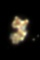<span style="font-size: 10px;">dirt</span></div>
  <div style="text-align: center;"><span style="font-size: 10px;">eudiaptomus</span></div>
  <div style="text-align: center;">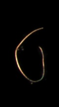<span style="font-size: 10px;">filament</span></div>
  
  <div style="text-align: center;">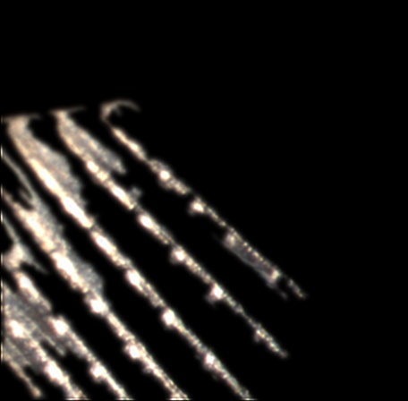<span style="font-size: 10px;">fish</span></div>
  <div style="text-align: center;">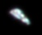<span style="font-size: 10px;">fragilaria</span></div>
  <div style="text-align: center;"><span style="font-size: 10px;">hydra</span></div>
  <div style="text-align: center;">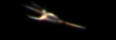<span style="font-size: 10px;">kellicottia</span></div>
  <div style="text-align: center;">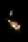<span style="font-size: 10px;">keratella_cochlearis</span></div>
  <div style="text-align: center;"><span style="font-size: 10px;">keratella_quadrata</span></div>
  
  <div style="text-align: center;">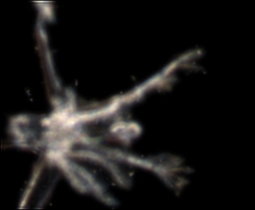<span style="font-size: 10px;">leptodora</span></div>
  <div style="text-align: center;">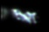<span style="font-size: 10px;">maybe_cyano</span></div>
  <div style="text-align: center;">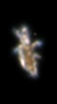<span style="font-size: 10px;">nauplius</span></div>
  <div style="text-align: center;">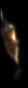<span style="font-size: 10px;">paradileptus</span></div>
  <div style="text-align: center;">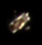<span style="font-size: 10px;">polyarthra</span></div>
  <div style="text-align: center;">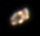<span style="font-size: 10px;">rotifers</span></div>
  
  <div style="text-align: center;">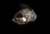<span style="font-size: 10px;">synchaeta</span></div>
  <div style="text-align: center;">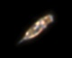<span style="font-size: 10px;">trichocerca</span></div>
  <div style="text-align: center;">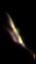<span style="font-size: 10px;">unknown</span></div>
  <div style="text-align: center;">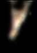<span style="font-size: 10px;">unknown_plankton</span></div>
  <div style="text-align: center;">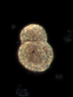<span style="font-size: 10px;">uroglena</span></div>
  <div style="text-align: center;"><span style="font-size: 10px;">daphnia</span></div>
</div>

---

## How to Run (Docker)

First, build the unified Docker image:

```bash
docker build -t quantum-mnist .
```

### Run Phase 2: Basic Binary Quantum (Data Ingress)
To verify the plankton data loading and class pairs:
```bash
docker run --rm quantum-mnist python phasetwo/plankton_ingress.py
```

### Run Phase 3: Optimise via Param Sweep
To see the hyperparameter sweep configuration:
```bash
docker run --rm quantum-mnist python phasethree/optimize_binary_classifier.py
```

### Run Phase 4: Compare to Classical (Full Experiments)
To run the full experiment suite and save results to your local machine:
```bash
docker run --rm -v $(pwd)/phasefour/results:/app/phasefour/results quantum-mnist python phasefour/run_experiments.py
```
