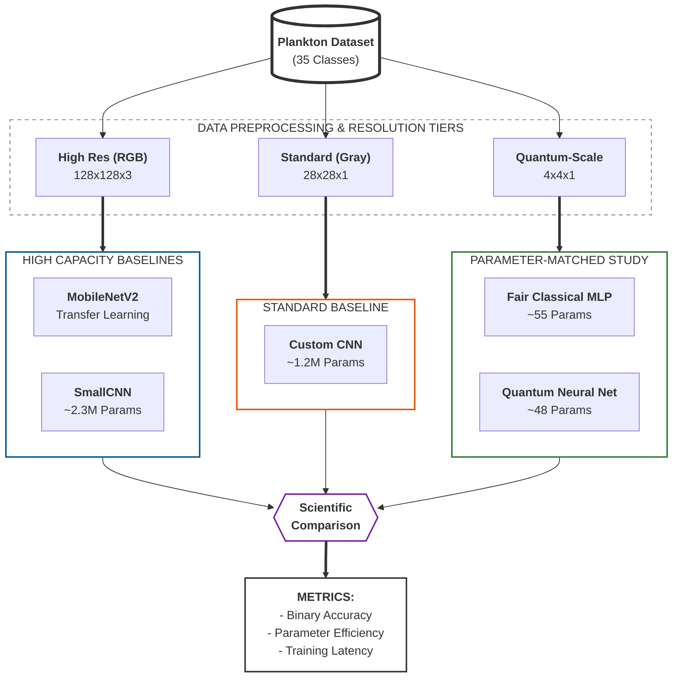
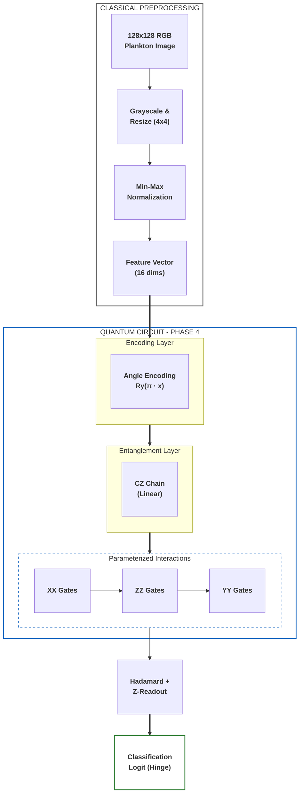

# Phase 4: Generalized Quantum vs. Classical Deep Learning

This phase evaluates the generalized quantum algorithm against several classical baselines spanning high-capacity convolutional models, transfer learning, and a deliberately parameter-constrained multilayer perceptron. The objective is not only to compare raw accuracy, but also to distinguish the effects of representational capacity, input resolution, and parameter budget.

### 1. Hybrid Comparison Pipeline
The Phase 4 evaluation employs a multi-resolution benchmarking strategy to isolate the effects of architectural capacity versus parameter efficiency.



## 1. Classical Neural Architectures

Three classical baselines are used to contextualize the quantum results across markedly different modeling regimes. `MobileNetV2` represents a high-capacity transfer-learning baseline, `SmallCNN` provides a task-specific convolutional reference model, and the `Fair Classical` multilayer perceptron is intentionally restricted to approximately the same parameter count as the quantum model.

| Model | Role in study | Input | Architecture summary | Approx. complexity |
| :--- | :--- | :--- | :--- | :--- |
| `MobileNetV2` | High-capacity transfer baseline | `128x128` RGB | Frozen pretrained backbone with a custom dropout-plus-linear classification head | High |
| `SmallCNN` | Task-specific convolutional baseline | `128x128` RGB | Four convolutional blocks followed by a 256-unit fully connected layer with dropout | ~2.3M parameters |
| `Fair Classical` MLP | Parameter-matched baseline | `4x4` grayscale | `Flatten(16) -> Dense(3, ReLU) -> Dense(1, Sigmoid)` | 55 parameters |

The purpose of the parameter-matched model is especially important. It provides a direct comparison between classical and quantum learners under nearly identical information and parameter constraints, rather than allowing the classical model to dominate purely through scale.

---

## 2. Quantum Neural Architecture (QNN)

The Phase 4 QNN utilizes an expressive Parameterized Quantum Circuit (PQC) with multi-axis interactions, optimized for 4x4 downsampled features.



The QNN uses **Angle Encoding**, mapping each normalized pixel intensity to an $Ry$ rotation so that grayscale information is preserved rather than thresholded away. A linear chain of $CZ$ gates introduces spatial correlations across the 4x4 grid, after which parameterized $XX$, $ZZ$, and $YY$ interactions couple the data qubits to the readout qubit. Optimization is performed with **Hinge loss**, which aligns naturally with the $[-1, 1]$ expectation-value output of the quantum measurement.

---

## 3. Image Resolution & Normalization

Unlike Phase 2, which largely operated at a single working resolution, Phase 4 adopts a multi-resolution evaluation strategy so that each model is assessed in a regime appropriate to its design.

High-capacity classical models (`MobileNetV2` and `SmallCNN`) receive `128x128` RGB inputs, preserving color and fine morphological detail. The intermediate CNN baseline uses `28x28` grayscale inputs to provide a mid-scale reference point. The `Fair Classical` MLP and the QNN both operate on `4x4` grayscale inputs. For the QNN, this is a practical consequence of simulating a 16-qubit data register; for the classical MLP, it is a deliberate constraint introduced to ensure that both models receive the same information density.

All image resizing is performed with **bilinear interpolation** to reduce aliasing artifacts during downsampling.

## 4. EAWAG Zooplankton Benchmark
The dataset used in this project was introduced in *Deep Learning Classification of Lake Zooplankton* by **S. Kyathanahally, T. Hardeman, E. Merz, T. Kozakiewicz, M. Reyes, P. Isles, F. Pomati, and M. Baity-Jesi** (Eawag, 2021). In that study, the authors reported **98% accuracy** on a 35-class task using ensembles of DenseNet, ResNet, and MobileNet models operating on `128x128` images.

The comparison in Phase 4 is intentionally narrower. Rather than reproducing the full multi-class, high-resolution setting of the EAWAG study, this phase compares the present binary QNN against the paper's reported feature-based MLP result (**91.2%**) under a strongly constrained `4x4` input representation. The goal is therefore to assess performance under matched low-information conditions, not to claim equivalence with the full-resolution benchmark.

## 5. Performance Comparison (Binary)
We conduct head-to-head evaluations on **25 plankton pairs** selected via power analysis (see below) to establish the performance of the QNN against its classical counterparts with sufficient statistical power.

---

## 6. Statistical Design & Power Analysis

### Pair Selection
The 25 plankton pairs were selected with a deterministic greedy algorithm that ensures every eligible biological class appears at least once, while preferentially selecting class pairs with similar sample sizes to reduce imbalance-related confounds. The procedure uses `seed=42` for reproducibility.

Excluded classes include ambiguous categories (`unknown`, `unknown_plankton`, `dirt`, `fish`, `filament`) and any class with fewer than 80 images.

### Why 25 Pairs?
A power analysis, implemented in `utils/power_analysis.py`, motivated the use of 25 pairs. With only five folds per pair, the **Wilcoxon signed-rank test cannot achieve p < 0.05** because its minimum attainable p-value is 0.0625. Per-pair paired t-tests are similarly underpowered, requiring **Cohen's d >= 1.62** to reach 80% power at `n = 5`, which is unrealistically large for this setting.

To address this limitation, the study treats class pairs, rather than folds, as the unit of replication and performs one-sample t-tests and Wilcoxon tests on the distribution of pair-level accuracy differences (`QNN - Fair Classical`). At the pilot-observed effect size (`d ≈ 0.65`), 25 pairs provide approximately **88% power**.

### Statistical Testing (Two Levels)
1. **Per-pair** (exploratory): Paired t-test across 5 folds for each pair. These are underpowered by design and should be interpreted with caution.
2. **Aggregate** (confirmatory): One-sample t-test and Wilcoxon signed-rank on the 25 pair-level mean accuracy deltas. This is the primary analysis. Results are saved to `aggregate_test.json`.

---

## 7. Scientific Rigor & Reproducibility

Phase 4 is designed around reproducibility and statistical discipline. All experiments run in a containerized environment with pinned dependencies, including `tensorflow==2.7.0` and `tensorflow-quantum==0.7.2`, to minimize hardware- and environment-specific variability. Each plankton pair is evaluated with **5-fold stratified cross-validation**, preserving class proportions across folds while recording per-fold performance for later aggregation.

All models are trained under equal sample budgets so that differences in performance are not confounded by unequal data exposure. The `Fair Classical` model is intentionally tuned to remain close to the QNN in parameter count (`~55` versus `~48`), which keeps the comparison focused on representation and inductive bias rather than raw model size. An automated `test_rigor.py` suite is executed during the Docker build to verify data loading, parameter counts, and circuit construction before experiments are run.

The statistical analysis is explicitly two-tiered: per-pair tests are reported for transparency but treated as exploratory, while the aggregate analysis across all selected pairs serves as the confirmatory test. When additional variability estimates are required, repeated cross-validation can be enabled through `N_REPEATS` and `BASE_SEED`.

### Running the Experiments

To reproduce these results using the rigorous Docker environment:

```bash
# Build the image (includes automated rigor tests)
docker build --platform linux/amd64 -t quantum-plankton .

# Run power analysis report
docker run --rm --platform linux/amd64 quantum-plankton python utils/power_analysis.py

# Run the experiments and extract results
docker run --rm --platform linux/amd64 -v $(pwd)/phase4/results:/app/phase4/results quantum-plankton python phase4/run_experiments.py
```

---

## 8. Results & Analysis (Binary)

The Phase 4 evaluation compares quantum and classical models across 25 plankton pairs using 5-fold stratified CV per pair, with an aggregate statistical test as the primary analysis.

### Experimental Results Summary

<!-- P4_RESULTS_START -->
| Pair | QNN Accuracy | Fair Classical | P-Value | Significant? |
| --- | --- | --- | --- | --- |
| aphanizomenon_vs_leptodora | 57.2% | 55.1% | 0.5117 | False |
| asplanchna_vs_uroglena | 73.7% | 61.2% | 0.0691 | False |
| asterionella_vs_diaphanosoma | 63.8% | 55.3% | 0.0057 | False |
| asterionella_vs_rotifers | 58.9% | 55.4% | 0.2831 | False |
| asterionella_vs_uroglena | 86.0% | 59.4% | 0.0133 | False |
| bosmina_vs_brachionus | 75.9% | 62.2% | 0.0781 | False |
| bosmina_vs_polyarthra | 51.2% | 46.9% | 0.2056 | False |
| brachionus_vs_synchaeta | 53.0% | 53.0% | 0.9978 | False |
| ceratium_vs_cyclops | 49.5% | 53.6% | 0.1645 | False |
| conochilus_vs_daphnia | 73.3% | 70.1% | 0.2517 | False |
| conochilus_vs_fragilaria | 65.1% | 53.5% | 0.0778 | False |
| conochilus_vs_keratella_cochlearis | 70.2% | 68.9% | 0.3739 | False |
| conochilus_vs_trichocerca | 53.6% | 50.3% | 0.4479 | False |
| cyclops_vs_kellicottia | 62.5% | 61.7% | 0.4213 | False |
| daphnia_vs_kellicottia | 58.1% | 56.2% | 0.3285 | False |
| daphnia_vs_rotifers | 81.6% | 61.1% | 0.0173 | False |
| dinobryon_vs_nauplius | 68.8% | 61.1% | 0.3739 | False |
| eudiaptomus_vs_kellicottia | 51.6% | 53.3% | 0.1638 | False |
| eudiaptomus_vs_uroglena | 95.5% | 66.6% | 0.0002 | True |
| fragilaria_vs_keratella_cochlearis | 73.2% | 64.8% | 0.3739 | False |
| keratella_quadrata_vs_paradileptus | 60.9% | 52.8% | 0.0044 | False |
| keratella_quadrata_vs_rotifers | 63.9% | 63.1% | 0.3739 | False |
| keratella_quadrata_vs_uroglena | 72.0% | 69.6% | 0.3576 | False |
| leptodora_vs_paradileptus | 67.6% | 73.2% | 0.1493 | False |
| maybe_cyano_vs_nauplius | 53.1% | 56.3% | 0.3471 | False |
<!-- P4_RESULTS_END -->

### Aggregate Test

After all 25 pairs complete, `aggregate_test.json` contains the primary analysis:
- **mean_delta**: Mean accuracy difference (QNN − Fair Classical) across all pairs
- **effect_size_d**: Cohen's d for the aggregate effect
- **ttest_p**: One-sample t-test p-value
- **wilcoxon_p**: Wilcoxon signed-rank p-value
- **qnn_wins / fair_wins**: Win/loss count across pairs

### Key Observations:

*Results pending — the 25-pair experiment suite takes approximately 6 hours under x86 emulation. Previous 4-pair pilot data (mean delta = +8.95%, d = 0.66) suggests a moderate quantum advantage at 4×4 resolution, but the aggregate test across 25 pairs is needed to confirm this with adequate statistical power.*

### Conclusion:

*Pending aggregate test results. The expanded 25-pair design provides ~88% power to detect the pilot-observed effect size (d ≈ 0.65), compared to only ~9% power with the original 4-pair design.*

Full experimental data is archived in `phase4/results/experiment_results.csv` and `phase4/results/aggregate_test.json`.
