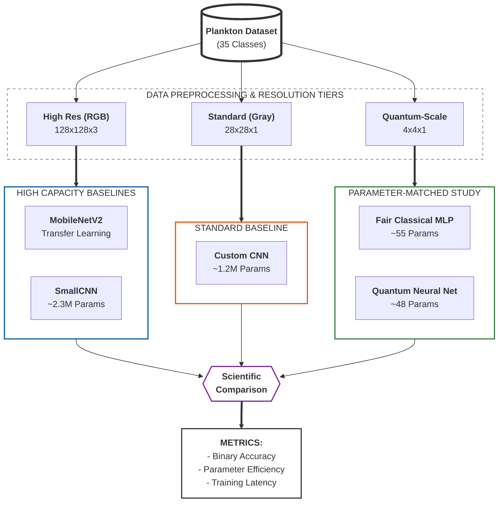
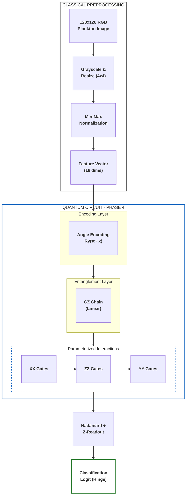

# Phase 4: Generalized Quantum vs. Classical Deep Learning

In this phase, we compare the generalized quantum algorithm's performance against established classical deep learning architectures. This includes a high-capacity CNN, transfer learning via MobileNetV2, and a "Fair Classical" model designed to match the parameter constraints of the quantum circuit.

### 1. Hybrid Comparison Pipeline
The Phase 4 evaluation employs a multi-resolution benchmarking strategy to isolate the effects of architectural capacity versus parameter efficiency.



## 1. Classical Neural Architectures

We evaluate three classical baselines to establish benchmarks across different scales of complexity.

### A. MobileNetV2 (Transfer Learning)
Leveraging a state-of-the-art architecture pretrained on ImageNet to identify complex morphological features in plankton.
- **Base**: MobileNetV2 (Frozen convolutional layers).
- **Head**: Custom classification head [Dropout(0.3) -> Linear(35)].
- **Input**: 128x128 RGB images.
- **Complexity**: High (Benefit of feature extraction from millions of images).

### B. SmallCNN (Custom)
A custom convolutional neural network designed specifically for this dataset.
- **Layers**: 4x [Conv2D -> ReLU -> MaxPool].
- **Channel Depth**: 32, 64, 128, 128.
- **Fully Connected**: 256 units with 50% Dropout.
- **Input**: 128x128 RGB images.
- **Complexity**: Medium (~2.3M parameters).

### C. "Fair" Classical Baseline
A minimal Multi-Layer Perceptron (MLP) that matches the low parameter count (~48) of the Quantum Neural Network.
- **Architecture**: Flatten(16) -> Dense(3 units, ReLU) -> Dense(1 unit, Sigmoid) = 55 parameters.
- **Input**: 4x4 Grayscale images.
- **Purpose**: To provide a direct comparison of "Parameter Efficiency" between classical and quantum regimes.

---

## 2. Quantum Neural Architecture (QNN)

The Phase 4 QNN utilizes an expressive Parameterized Quantum Circuit (PQC) with multi-axis interactions, optimized for 4x4 downsampled features.



### Key Quantum Components:
*   **Angle Encoding:** Preserves 4-bit grayscale intensity by mapping pixel values to $Ry$ rotations.
*   **Linear Entanglement:** A chain of $CZ$ gates allows for spatial feature correlation across the 4x4 grid.
*   **Multi-Axis Interactions:** Uses parameterized $XX$, $ZZ$, and $YY$ interactions between data qubits and the readout qubit to capture non-commuting correlations.
*   **Optimization:** Trained using the **Hinge Loss** function, which is naturally suited for the $[-1, 1]$ expectation value of the quantum readout.

---

## 3. Image Resolution & Normalization

Unlike Phase 2, which primarily used a consistent 16x16 resolution for both classical and quantum models, Phase 4 employs a multi-resolution strategy to evaluate models at their intended scale:

*   **128x128 RGB:** Used for high-capacity classical models (**MobileNetV2** and **SmallCNN**). This preserves color information and fine morphological details (e.g., cilia, vacuoles) that are lost at lower resolutions.
*   **28x28 Grayscale:** Used for the standard custom **CNN** baseline to provide a middle-ground benchmark.
*   **4x4 Grayscale:** Used for both the **Fair Classical** MLP and the **QNN**. 
    *   For the QNN, this resolution is a technical constraint of simulating 16 qubits.
    *   For the Fair Classical model, this ensures a "fair" comparison by forcing the classical model to learn from the exact same information density as the quantum model.

All resolutions utilize **Bilinear Interpolation** for resizing to minimize aliasing artifacts during downsampling.

## 4. Swiss Paper Benchmark (EAWAG Greifensee)
The dataset used in this project originated from the research by **Kyathanahally et al. (2021)**. Their state-of-the-art models (DenseNet, ResNet, and MobileNet ensembles) achieved **98% accuracy** on 35 classes using 128x128 resolution.

Phase 4 compares our binary QNN results against their feature-based MLP results (91.2%) to evaluate the efficiency of quantum feature extraction on a restricted 4x4 input space.

## 5. Performance Comparison (Binary)
We conduct head-to-head evaluations on **25 plankton pairs** selected via power analysis (see below) to establish the performance of the QNN against its classical counterparts with sufficient statistical power.

---

## 6. Statistical Design & Power Analysis

### Pair Selection
The 25 plankton pairs were selected using a deterministic greedy algorithm that:
1. Ensures all 25 eligible biological classes are represented at least once
2. Prefers balanced-size pairs to avoid class-imbalance confounds
3. Uses `seed=42` for full reproducibility

Classes excluded: ambiguous categories (unknown, unknown_plankton, dirt, fish, filament) and classes with fewer than 80 images.

### Why 25 Pairs?
A power analysis (see `utils/power_analysis.py`) revealed:
- At n=5 folds, the **Wilcoxon signed-rank test cannot produce p < 0.05** (minimum p = 0.0625)
- Per-pair paired t-tests require **Cohen's d >= 1.62** for 80% power at n=5 — unrealistically large
- **Solution**: Treat pairs as the unit of replication. Run a one-sample t-test / Wilcoxon across all 25 pair-level accuracy deltas (QNN − Fair Classical)
- At the pilot-observed effect size (d ≈ 0.65), 25 pairs provide **~88% power**

### Statistical Testing (Two Levels)
1. **Per-pair** (exploratory): Paired t-test across 5 folds for each pair. These are underpowered by design and should be interpreted with caution.
2. **Aggregate** (confirmatory): One-sample t-test and Wilcoxon signed-rank on the 25 pair-level mean accuracy deltas. This is the primary analysis. Results are saved to `aggregate_test.json`.

---

## 7. Scientific Rigor & Reproducibility

To ensure the validity of these results, Phase 4 incorporates several rigorous methodological standards:

*   **Dockerized Environment:** All experiments are run within a containerized environment with pinned dependency versions (`tensorflow==2.7.0`, `tensorflow-quantum==0.7.2`, etc.) to ensure bit-for-bit reproducibility across different hardware.
*   **5-Fold Stratified Cross-Validation:** Each pair is evaluated using 5-fold stratified CV. Per-fold accuracy is recorded, and per-pair statistics (mean, std) are computed across folds.
*   **Equal Sample Budgets:** All models (QNN, Fair Classical, CNN) train on the same number of samples per fold to avoid data-quantity confounds.
*   **Stratified Data Splitting:** We use stratified random sampling to ensure that each fold maintains the original class distribution, preventing bias from class imbalance.
*   **Automated Verification:** A `test_rigor.py` suite is executed during the Docker build process to verify data loading integrity, parameter counts, and quantum circuit encoding before any experiments begin.
*   **Two-Level Statistical Testing:** Per-pair tests (exploratory, underpowered) and aggregate test across all pairs (confirmatory, powered at ~88%). See Section 6.
*   **Parameter Alignment:** The "Fair Classical" model was specifically tuned (3 hidden units) to align its parameter count (~55) as closely as possible with the QNN (~48), providing a statistically sound comparison of model capacity.
*   **Repeated CV (optional):** Set `N_REPEATS` (and `BASE_SEED`) to run multiple independent CV shuffles per pair to quantify variability beyond a single split.

### Running the Experiments

To reproduce these results using the rigorous Docker environment:

```bash
# Build the image (includes automated rigor tests)
docker build --platform linux/amd64 -t quantum-plankton .

# Run power analysis report
docker run --rm --platform linux/amd64 quantum-plankton python utils/power_analysis.py

# Run the experiments and extract results
docker run --rm --platform linux/amd64 -v $(pwd)/phase4/results:/app/phase4/results quantum-plankton python phase4/run_experiments.py
```

---

## 8. Results & Analysis (Binary)

The Phase 4 evaluation compares quantum and classical models across 25 plankton pairs using 5-fold stratified CV per pair, with an aggregate statistical test as the primary analysis.

### Experimental Results Summary

<!-- P4_RESULTS_START -->
| Pair | QNN Accuracy | Fair Classical | P-Value | Significant? |
| --- | --- | --- | --- | --- |
| *Results will be populated after running experiments on 25 pairs* | | | | |
<!-- P4_RESULTS_END -->

### Aggregate Test

After all 25 pairs complete, `aggregate_test.json` contains the primary analysis:
- **mean_delta**: Mean accuracy difference (QNN − Fair Classical) across all pairs
- **effect_size_d**: Cohen's d for the aggregate effect
- **ttest_p**: One-sample t-test p-value
- **wilcoxon_p**: Wilcoxon signed-rank p-value
- **qnn_wins / fair_wins**: Win/loss count across pairs

### Key Observations:

*Results pending — the 25-pair experiment suite takes approximately 6 hours under x86 emulation. Previous 4-pair pilot data (mean delta = +8.95%, d = 0.66) suggests a moderate quantum advantage at 4×4 resolution, but the aggregate test across 25 pairs is needed to confirm this with adequate statistical power.*

### Conclusion:

*Pending aggregate test results. The expanded 25-pair design provides ~88% power to detect the pilot-observed effect size (d ≈ 0.65), compared to only ~9% power with the original 4-pair design.*

Full experimental data is archived in `phase4/results/experiment_results.csv` and `phase4/results/aggregate_test.json`.
