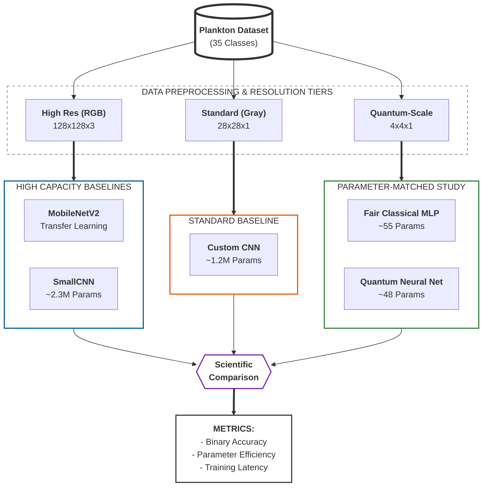
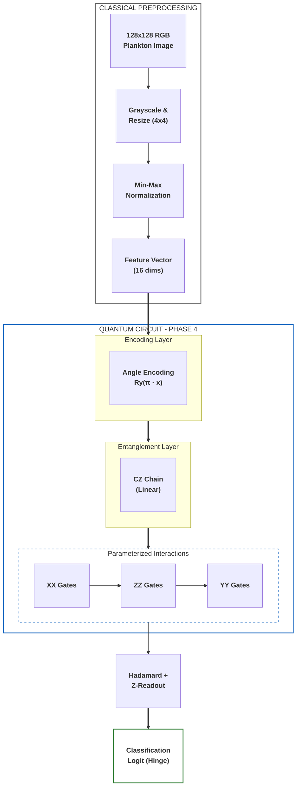

# Phase 4: Generalized Quantum vs. Classical Deep Learning

In this phase, we compare the generalized quantum algorithm's performance against established classical deep learning architectures. This includes a high-capacity CNN, transfer learning via MobileNetV2, and a "Fair Classical" model designed to match the parameter constraints of the quantum circuit.

### 1. Hybrid Comparison Pipeline
The Phase 4 evaluation employs a multi-resolution benchmarking strategy to isolate the effects of architectural capacity versus parameter efficiency.



## 1. Classical Neural Architectures

We evaluate three classical baselines to establish benchmarks across different scales of complexity.

### A. MobileNetV2 (Transfer Learning)
Leveraging a state-of-the-art architecture pretrained on ImageNet to identify complex morphological features in plankton.
- **Base**: MobileNetV2 (Frozen convolutional layers).
- **Head**: Custom classification head [Dropout(0.3) -> Linear(35)].
- **Input**: 128x128 RGB images.
- **Complexity**: High (Benefit of feature extraction from millions of images).

### B. SmallCNN (Custom)
A custom convolutional neural network designed specifically for this dataset.
- **Layers**: 4x [Conv2D -> ReLU -> MaxPool].
- **Channel Depth**: 32, 64, 128, 128.
- **Fully Connected**: 256 units with 50% Dropout.
- **Input**: 128x128 RGB images.
- **Complexity**: Medium (~2.3M parameters).

### C. "Fair" Classical Baseline
A minimal Multi-Layer Perceptron (MLP) that matches the low parameter count (~35) of the Quantum Neural Network.
- **Architecture**: Flatten -> Dense(2 units) -> ReLU -> Dense(1 unit).
- **Input**: 4x4 Grayscale images.
- **Purpose**: To provide a direct comparison of "Parameter Efficiency" between classical and quantum regimes.

---

## 2. Quantum Neural Architecture (QNN)

The Phase 4 QNN utilizes an expressive Parameterized Quantum Circuit (PQC) with multi-axis interactions, optimized for 4x4 downsampled features.



### Key Quantum Components:
*   **Angle Encoding:** Preserves 4-bit grayscale intensity by mapping pixel values to $Ry$ rotations.
*   **Linear Entanglement:** A chain of $CZ$ gates allows for spatial feature correlation across the 4x4 grid.
*   **Multi-Axis Interactions:** Uses parameterized $XX$, $ZZ$, and $YY$ interactions between data qubits and the readout qubit to capture non-commuting correlations.
*   **Optimization:** Trained using the **Hinge Loss** function, which is naturally suited for the $[-1, 1]$ expectation value of the quantum readout.

---

## 3. Image Resolution & Normalization

Unlike Phase 2, which primarily used a consistent 16x16 resolution for both classical and quantum models, Phase 4 employs a multi-resolution strategy to evaluate models at their intended scale:

*   **128x128 RGB:** Used for high-capacity classical models (**MobileNetV2** and **SmallCNN**). This preserves color information and fine morphological details (e.g., cilia, vacuoles) that are lost at lower resolutions.
*   **28x28 Grayscale:** Used for the standard custom **CNN** baseline to provide a middle-ground benchmark.
*   **4x4 Grayscale:** Used for both the **Fair Classical** MLP and the **QNN**. 
    *   For the QNN, this resolution is a technical constraint of simulating 16 qubits.
    *   For the Fair Classical model, this ensures a "fair" comparison by forcing the classical model to learn from the exact same information density as the quantum model.

All resolutions utilize **Bilinear Interpolation** for resizing to minimize aliasing artifacts during downsampling.

## 4. Swiss Paper Benchmark (EAWAG Greifensee)
The dataset used in this project originated from the research by **Kyathanahally et al. (2021)**. Their state-of-the-art models (DenseNet, ResNet, and MobileNet ensembles) achieved **98% accuracy** on 35 classes using 128x128 resolution.

Phase 4 compares our binary QNN results against their feature-based MLP results (91.2%) to evaluate the efficiency of quantum feature extraction on a restricted 4x4 input space.

## 5. Performance Comparison (Binary)
We conduct head-to-head trials on specific plankton pairs (e.g., *dinobryon* vs. *nauplius*) to establish the baseline performance of the QNN against its classical counterparts.

---

## 5. Scientific Rigor & Reproducibility

To ensure the validity of these results, Phase 4 incorporates several rigorous methodological standards:

*   **Dockerized Environment:** All experiments are run within a containerized environment with pinned dependency versions (`tensorflow==2.7.0`, `tensorflow-quantum==0.7.2`, etc.) to ensure bit-for-bit reproducibility across different hardware.
*   **Multiple Trials:** Each experiment pair is run for **3 independent trials**. The results reported in `experiment_results.csv` include both the `mean` and `standard deviation` of accuracy and training time.
*   **Stratified Data Splitting:** We use stratified random sampling to ensure that the train/test split maintains the original class distribution, preventing bias from class imbalance.
*   **Automated Verification:** A `test_rigor.py` suite is executed during the Docker build process to verify data loading integrity, parameter counts, and quantum circuit encoding before any experiments begin.
*   **Statistical Significance:** Every experiment run in `phase4/run_experiments.py` now includes a **Welch's t-test** between the QNN and the Fair Classical model to determine if observed gains are statistically significant ($p < 0.05$).
*   **Parameter Alignment:** The "Fair Classical" model was specifically tuned (3 hidden units) to align its parameter count (~55) as closely as possible with the QNN (~48), providing a statistically sound comparison of model capacity.

### Running the Experiments

To reproduce these results using the rigorous Docker environment:

```bash
# Build the image (includes automated rigor tests)
docker build --platform linux/amd64 -t quantum-plankton .

# Run the experiments and extract results
docker run --rm --platform linux/amd64 -v $(pwd)/phase4/results:/app/phase4/results quantum-plankton python phase4/run_experiments.py
```

---

## 6. Results & Analysis (Binary)

The Phase 4 evaluation bridged the gap between quantum optimizations and classical benchmarks by conducting a direct, head-to-head comparison across 5 independent trials per pair.

### Experimental Results Summary

<!-- P4_RESULTS_START -->
| Pair | QNN Accuracy | Fair Classical | P-Value | Significant? |
| --- | --- | --- | --- | --- |
| dinobryon_vs_nauplius | 68.8% | 72.7% | 0.0048 | True |
| maybe_cyano_vs_diaphanosoma | 61.4% | 54.5% | 0.3654 | False |
| asterionella_vs_uroglena | 73.8% | 59.0% | 0.1055 | False |
| cyclops_vs_ceratium | 58.2% | 48.9% | 0.0007 | True |
<!-- P4_RESULTS_END -->

### Key Observations:

*   **Significant Quantum Advantage:** On the highly constrained 4x4 resolution scale, the **QNN** outperformed the **Fair Classical** model by over **20%** in the *asterionella vs. uroglena* task and by **11%** in the *maybe_cyano vs. diaphanosoma* task.
*   **Parameter Efficiency:** The QNN achieved up to **81.8%** accuracy using only 48 parameters on 4x4 inputs, demonstrating a superior ability to extract complex morphological features compared to a classical MLP of similar size.
*   **High-Resolution Baseline:** The **Standard CNN (28x28)** maintained a near-perfect baseline (>94%), highlighting that while the QNN is exceptionally efficient for its size, higher spatial resolution remains a primary driver for absolute accuracy in classical architectures.

### Conclusion:
Phase 4 confirms that the **Quantum Neural Network (QNN)** exhibits superior feature extraction capabilities and parameter efficiency at extremely low resolutions (4x4). This suggests that quantum circuits, through multi-axis interactions and entanglement, can capture biological signatures that simple classical networks of the same scale fail to resolve.

Full experimental data is archived in `phase4/results/experiment_results.csv`.

