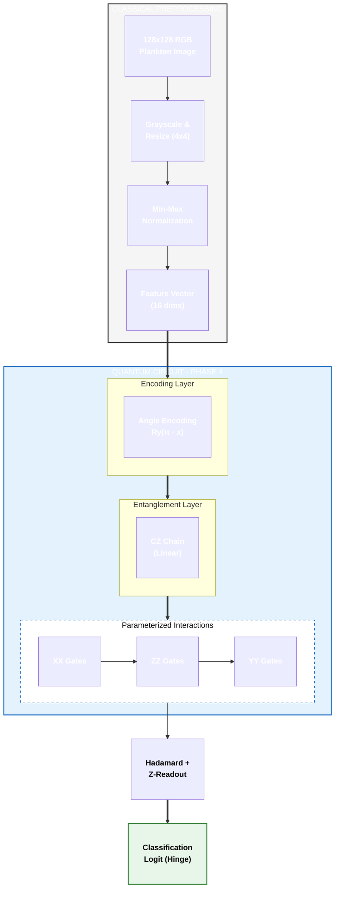

# Phase 4: Generalized Quantum vs. Classical Deep Learning

In this phase, we compare the generalized quantum algorithm's performance against established classical deep learning architectures. This includes a high-capacity CNN, transfer learning via MobileNetV2, and a "Fair Classical" model designed to match the parameter constraints of the quantum circuit.

## 1. Classical Neural Architectures

We evaluate three classical baselines to establish benchmarks across different scales of complexity.

### A. MobileNetV2 (Transfer Learning)
Leveraging a state-of-the-art architecture pretrained on ImageNet to identify complex morphological features in plankton.
- **Base**: MobileNetV2 (Frozen convolutional layers).
- **Head**: Custom classification head [Dropout(0.3) -> Linear(35)].
- **Input**: 128x128 RGB images.
- **Complexity**: High (Benefit of feature extraction from millions of images).

### B. SmallCNN (Custom)
A custom convolutional neural network designed specifically for this dataset.
- **Layers**: 4x [Conv2D -> ReLU -> MaxPool].
- **Channel Depth**: 32, 64, 128, 128.
- **Fully Connected**: 256 units with 50% Dropout.
- **Input**: 128x128 RGB images.
- **Complexity**: Medium (~2.3M parameters).

### C. "Fair" Classical Baseline
A minimal Multi-Layer Perceptron (MLP) that matches the low parameter count (~35) of the Quantum Neural Network.
- **Architecture**: Flatten -> Dense(2 units) -> ReLU -> Dense(1 unit).
- **Input**: 4x4 Grayscale images.
- **Purpose**: To provide a direct comparison of "Parameter Efficiency" between classical and quantum regimes.

---

## 2. Quantum Neural Architecture (QNN)

The Phase 4 QNN utilizes an expressive Parameterized Quantum Circuit (PQC) with multi-axis interactions, optimized for 4x4 downsampled features.

### Key Quantum Components:
*   **Angle Encoding:** Preserves 4-bit grayscale intensity by mapping pixel values to $Ry$ rotations.
*   **Linear Entanglement:** A chain of $CZ$ gates allows for spatial feature correlation across the 4x4 grid.
*   **Multi-Axis Interactions:** Uses parameterized $XX$, $ZZ$, and $YY$ interactions between data qubits and the readout qubit to capture non-commuting correlations.
*   **Optimization:** Trained using the **Hinge Loss** function, which is naturally suited for the $[-1, 1]$ expectation value of the quantum readout.

---

## 3. Comparison Metrics

| Model | Input Size | Params (Approx) | Data Format |
| :--- | :--- | :--- | :--- |
| **MobileNetV2** | 128x128 | ~45K (Head) | RGB |
| **SmallCNN** | 128x128 | ~2.3M | RGB |
| **Fair Classical** | 4x4 | 35 | Grayscale |
| **QNN** | 4x4 | 48 | Quantum (Angle) |
