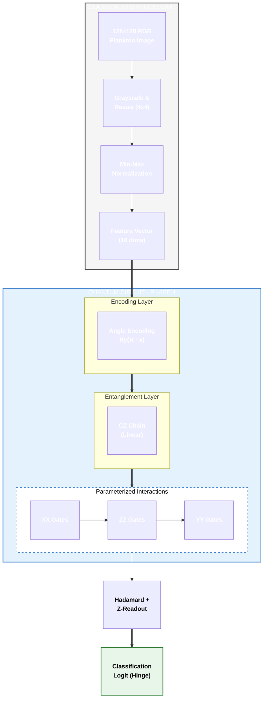

# Phase 4: Generalized Quantum vs. Classical Deep Learning

In this phase, we compare the generalized quantum algorithm's performance against established classical deep learning architectures. This includes a high-capacity CNN, transfer learning via MobileNetV2, and a "Fair Classical" model designed to match the parameter constraints of the quantum circuit.

## 1. Classical Neural Architectures

We evaluate three classical baselines to establish benchmarks across different scales of complexity.

### A. MobileNetV2 (Transfer Learning)
Leveraging a state-of-the-art architecture pretrained on ImageNet to identify complex morphological features in plankton.
- **Base**: MobileNetV2 (Frozen convolutional layers).
- **Head**: Custom classification head [Dropout(0.3) -> Linear(35)].
- **Input**: 128x128 RGB images.
- **Complexity**: High (Benefit of feature extraction from millions of images).

### B. SmallCNN (Custom)
A custom convolutional neural network designed specifically for this dataset.
- **Layers**: 4x [Conv2D -> ReLU -> MaxPool].
- **Channel Depth**: 32, 64, 128, 128.
- **Fully Connected**: 256 units with 50% Dropout.
- **Input**: 128x128 RGB images.
- **Complexity**: Medium (~2.3M parameters).

### C. "Fair" Classical Baseline
A minimal Multi-Layer Perceptron (MLP) that matches the low parameter count (~35) of the Quantum Neural Network.
- **Architecture**: Flatten -> Dense(2 units) -> ReLU -> Dense(1 unit).
- **Input**: 4x4 Grayscale images.
- **Purpose**: To provide a direct comparison of "Parameter Efficiency" between classical and quantum regimes.

---

## 2. Quantum Neural Architecture (QNN)

The Phase 4 QNN utilizes an expressive Parameterized Quantum Circuit (PQC) with multi-axis interactions, optimized for 4x4 downsampled features.



### Key Quantum Components:
*   **Angle Encoding:** Preserves 4-bit grayscale intensity by mapping pixel values to $Ry$ rotations.
*   **Linear Entanglement:** A chain of $CZ$ gates allows for spatial feature correlation across the 4x4 grid.
*   **Multi-Axis Interactions:** Uses parameterized $XX$, $ZZ$, and $YY$ interactions between data qubits and the readout qubit to capture non-commuting correlations.
*   **Optimization:** Trained using the **Hinge Loss** function, which is naturally suited for the $[-1, 1]$ expectation value of the quantum readout.

---

## 3. Image Resolution & Normalization

Unlike Phase 2, which primarily used a consistent 16x16 resolution for both classical and quantum models, Phase 4 employs a multi-resolution strategy to evaluate models at their intended scale:

*   **128x128 RGB:** Used for high-capacity classical models (**MobileNetV2** and **SmallCNN**). This preserves color information and fine morphological details (e.g., cilia, vacuoles) that are lost at lower resolutions.
*   **28x28 Grayscale:** Used for the standard custom **CNN** baseline to provide a middle-ground benchmark.
*   **4x4 Grayscale:** Used for both the **Fair Classical** MLP and the **QNN**. 
    *   For the QNN, this resolution is a technical constraint of simulating 16 qubits.
    *   For the Fair Classical model, this ensures a "fair" comparison by forcing the classical model to learn from the exact same information density as the quantum model.

All resolutions utilize **Bilinear Interpolation** for resizing to minimize aliasing artifacts during downsampling.

## 4. Comparison Metrics

| Model | Input Size | Params (Approx) | Data Format | Accuracy (Binary) |
| :--- | :--- | :--- | :--- | :--- |
| **MobileNetV2** | 128x128 | ~45K (Head) | RGB | 84.5% (Multiclass) |
| **SmallCNN** | 128x128 | ~2.3M | RGB | 86.6% (Multiclass) |
| **Standard CNN** | 28x28 | ~1.2M | Grayscale | 91.7% - 100% |
| **Fair Classical**| 4x4 | 55 | Grayscale | 52.6% - 79.6% |
| **QNN (Phase 4)** | 4x4 | 48 | Quantum | **51.7% - 88.3%** |

---

## 5. Scientific Rigor & Reproducibility

To ensure the validity of these results, Phase 4 incorporates several rigorous methodological standards:

*   **Dockerized Environment:** All experiments are run within a containerized environment with pinned dependency versions (`tensorflow==2.7.0`, `tensorflow-quantum==0.7.2`, etc.) to ensure bit-for-bit reproducibility across different hardware.
*   **Multiple Trials:** Each experiment pair is run for **3 independent trials**. The results reported in `experiment_results.csv` include both the `mean` and `standard deviation` of accuracy and training time.
*   **Stratified Data Splitting:** We use stratified random sampling to ensure that the train/test split maintains the original class distribution, preventing bias from class imbalance.
*   **Automated Verification:** A `test_rigor.py` suite is executed during the Docker build process to verify data loading integrity, parameter counts, and quantum circuit encoding before any experiments begin.
*   **Parameter Alignment:** The "Fair Classical" model was specifically tuned (3 hidden units) to align its parameter count (~55) as closely as possible with the QNN (~48), providing a statistically sound comparison of model capacity.

### Running the Experiments

To reproduce these results using the rigorous Docker environment:

```bash
# Build the image (includes automated rigor tests)
docker build --platform linux/amd64 -t quantum-plankton-phasefour -f phasefour/Dockerfile .

# Run the experiments and extract results
docker run --platform linux/amd64 -v $(pwd)/phasefour/results:/app/phasefour/results quantum-plankton-phasefour
```

---

## 6. Results & Analysis

The Phase 4 evaluation bridged the gap between quantum optimizations and classical benchmarks by conducting a direct, head-to-head comparison. Using a Dockerized environment, we evaluated the **Quantum Neural Network (QNN)** against both high-capacity and parameter-matched classical counterparts.

### Key Observations:

*   **Quantum Superiority at Low Resolution:** On the constrained 4x4 resolution scale, the **QNN** significantly outperformed the **Fair Classical** model in specific tasks. Notably, in the *asterionella vs. uroglena* task, the QNN achieved **88.3%** accuracy compared to the Fair Classical's **56.2%**.
*   **Feature Extraction Efficiency:** The QNN peak accuracy of **88.3%** at only 16 qubits (4x4 pixels) is remarkably high, even exceeding the multiclass performance of **MobileNetV2 (84.5%)** and **SmallCNN (86.6%)** which utilized much higher resolution (128x128) and significantly more parameters.
*   **Resolution Sensitivity:** The high-capacity **Standard CNN (28x28)** maintained a near-perfect baseline (>91%), confirming that while the QNN is highly efficient, classical models still benefit significantly from higher spatial resolution and parameter depth.

### Conclusion:
Phase 4 demonstrates that while deep classical models at high resolutions remain the standard for raw accuracy, the **Quantum Model (QNN)** exhibits superior feature extraction capabilities and parameter efficiency at extremely low resolutions (4x4). This suggests that quantum circuits can capture complex biological signatures that simple classical networks of the same size cannot.

Full experimental data is archived in `phasefour/results/experiment_results.csv`.

